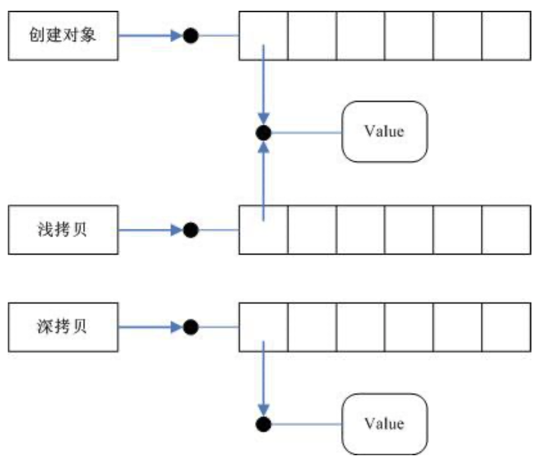
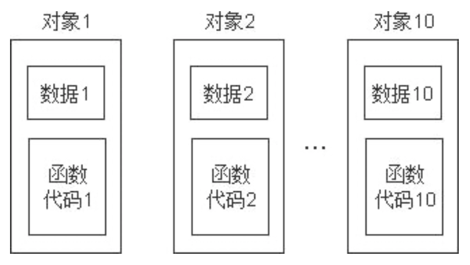
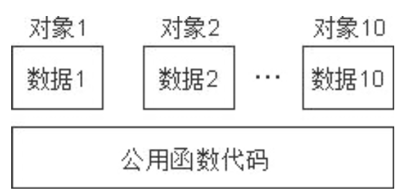
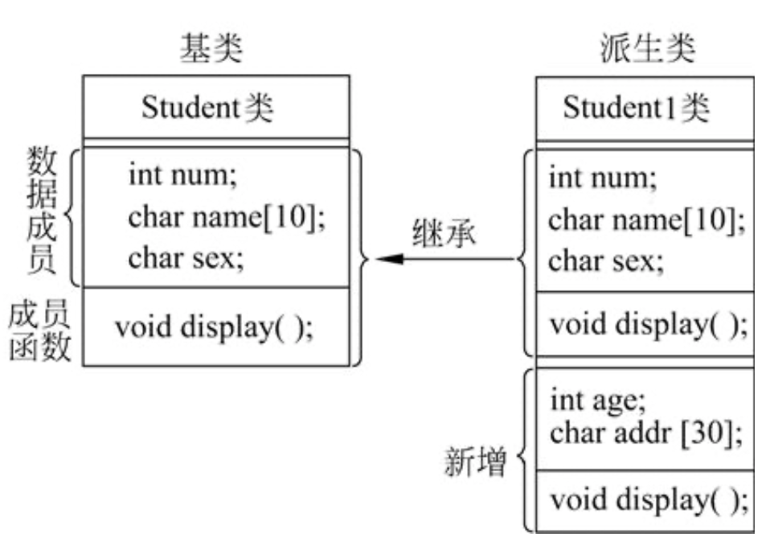
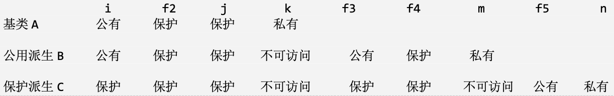

# C++基础与提高

## 一、简介

### 1. 作者

1982 年，美国 AT&T 公司贝尔实验室的 Bjarne Stroustrup 博士在 c 语言的基础上引 入并扩充了面向对象的概念，发明了一种新的程序语言。为了表达该语言与c语言的渊 源关系，它被命名为C++。而 Bjarne Stroustrup(本贾尼·斯特劳斯特卢普)博士被尊称为C++语言之父。


### 2. C++的产生与发展

C 语言作为结构化和模块化的语言，在处理较小规模的程序时，比较得心应手。但是当问题比较复杂，程序的规模较大的时，需要高度的抽象和建模时，c 语言显得力不 从心。

为了解决软件危机，20 世纪 80 年代，计算机界提出了 OOP(object oriented programming)思想，这需要设计出支持面向对象的程序设计语言。Smalltalk 就是当时 问世的一种面向对象的语言。而在实践中，人们发现 c 是语此深入人心，使用如此之广 泛，以至于最好的办法，不是发明一种新的语言去取代它，而是在原有的基础上发展它。 在这种情况下 c++应运而生，最初这门语言并不叫 c++而是 c with class (带类的 c)。

C++产生后，发展非常迅速：

- 1983 年 8 月， 第一个 C++实现投入使用
- 1983 年 12 月，Rick Mascitti 建议命名为 CPlusPlus，即 C++。
-  1985 年 2 月， 第一个 C++ Release E 发布。
-  10 月，CFront 的第一个商业发布，CFront Release 1.0。
-  10 月，Bjarne 博士完成了经典巨著 The C++ Programming Language 第一版 1986 年 11 月，C++第一个业移植 CFront 1.1,Glockenspiel。
- 1987 年 2 月， CFront Release 1.2 发布。
-  11 月，第一个 USENIX C++会议在新墨西哥州举行。
-  1988 年 10 月，第一次 USENIX C++实现者工作会议在科罗拉多州举行。
- 1989 年 12 月，ANSI X3J16 在华盛顿组织会议
- 1990 年 3 月， 第一次 ANSI X3J16 技术会议在新泽西州召开.
- 1990 年 5 月， C++的又一个传世经典 ARM 诞生。 1990 年 7 月， 模板被加入。 1990 年 11 月，异常被加入
- 1991 年 6 月， The C++ Programming Language 第二版完成。
- 1991 年 6 月， 第一次 ISO WG21 会议在瑞典召开。
- 1991 年 10 月，CFront Release 3.0 发布。
- 1993 年 3 月， 运行时类型识别在俄勒冈州被加入。
- 1993 年 7 月， 名字空间在德国慕尼黑被加入。
- 1994 年 8 月， ANSI/ISO 委员会草案登记。
- 1997 年 7 月， The C++ Programming Language 第三版完成。
- 1997 年 10 月，ISO 标准通过表决被接受
- 1998 年 11 月，ISO 标准被批准。

### 3. 应用领域

如果项目中，既要求效率又要建模和高度抽像，那就选择 c++吧。

- 系统层软件开发
- 服务器程序开发
- 游戏
- 网络
- 分布式
- 云计算
- 科学计算：比如大名鼎鼎的 ACE 等科学类库。

### 4. 学习路径

一般认为学习C++应先学习C语言，因为C++本身是兼容C语言的，而且有着更严格的语法检查，学习路径可以是：C语言-->C++扩展-->面向对象-->STL库使用-->模版编程-->设计模式。

个人看来，为了更好的理解面向对象思想，C语言不必先学，否则学的越好越容易受到影响。


## 二、C++基础

面向对象核心有三大要素：封装、继承、多态。接下来，我们将围绕这些展开介绍C++语言的面向对象思想，在这之前，先了解一下C++对C进行的扩展。

### 1. C扩展

C++程序的后缀是cpp，是c plus plus的缩写。

#### 1.1 输入输出流

C++标准头文件是<iostream>，它内部定义了iostream类，这个类又继承了istream和osteam，分别对应输入和输出，使用iostream类可以控制输入和输出。

cin和cout是C++的标准输入流和输出流，他们在iostream中定义了。来段程序来感受一下。

```c++
int main()
{
    char name[30];
    int age;
    cout<<"pls input name and age:"<<endl;
    cin>>name;
    cin>>age;
// cin>>name>>age;
    cout<<"your name is: "<<name<<endl; cout<<"your age is: "<<age<<endl;
    return 0;
}
```

当然，如果要使用标准c库的printf也是没问题的，包含stdio.h头文件就可以了。

#### 1.2 类型检查

C++的类型检查更严格，比如，把一个 const 类型的指针赋给非 const 类型的指针。c 语言中可以通过，

但是在 c++中则编不过去。

```c++
int main()
{
    const int a = 100; 
  	int b = a;
    const int *pa = &a;
    int *pb = pa;
    return 0;
}
```

c 语言的逻辑真假用 0 和非 0 来表示。而 c++中有了具体的类型。

```c++
int main()
{
    bool flag = true;
    if(flag != false)
    {
        printf("i know bool type now\n");
    }
    printf("bool size = %d\n",sizeof(bool)); return 0;
}
```

c 语言中枚举本质就是整型，枚举变量可以用任意整型赋值。而 c++中枚举变量，

只能用被枚举出来的元素初始化。下面的代码是无法通过编译的。

```C++
enum season {SPR,SUM,AUT,WIN}; 
int main()
{
    enum season s = SPR;
    s = 0;
    return 0;
}
```

#### 1.3 函数重载

所谓函数重载，就是出现相同名称的函数，当然C++对于函数重载是有自己的原则的。

```C++
//通过命名区分
int iabs(int a)
{
    return a>0? a:-a;
}
double fabs(double a)
{
    return a>0? a:-a;
}

//使用重载
int abs(int a)
{
    return a>0? a:-a; 
}
double abs(double a)
{
    return a>0? a:-a;
}
```

重载原则：

- 函数名相同
- 参数不同
  - 个数不同
  - 类型不同
  - 顺序不同
- 返回值不同不构成重载


```C++
void func(int a); //ok
void func(char a); //ok
void func(char a,int b); //ok
void func(int a, char b); //ok
char func(int a); //与第一个函数有冲突
```

匹配原则: 

- 严格匹配，找到则调用
- 通过隐式转换寻求一个匹配，找到则调用。

```C++
#include <iostream>
using namespace std;
void print(double a){
    cout<<a<<endl;
}
void print(int a){
    cout<<a<<endl;
}
int main(){
    print(1); // print(int)
    print(1.1); // print(double)
    print('a'); // print(int)
    print(1.11f); // print(double)
    return 0;
}
```


#### 1.4 默认参数

通常情况下，函数在调用时，形参从实参那里取得值。对于多次调用用一函数同一 实参时，C++给出了更简单的处理办法。给形参以默认值，这样就不用从实参那里取值 了。

```C++
#include <iostream>
#include <ctime>
using namespace std;
void weatherForcast(char * w="sunny")
{
    time_t t = time(0);
    char tmp[64];
    strftime( tmp, sizeof(tmp), "%Y/%m/%d %X %A ",localtime(&t) ); 
    cout<<tmp<< "today is weahter "<<w<<endl;
}
int main()
{
//sunny windy cloudy foggy rainy
    weatherForcast();
    weatherForcast("rainny");
    weatherForcast();
    return 0;
}
```

多个参数的情况下：

```C++
float volume(float length, float weight = 4,float high = 5)
{
    return length*weight*high;
}
int main()
{
    float v = volume(10); 
  	float v1 = volume(10,20);
    float v2 = volume(10,20,30);
    cout<<v<<endl;
    cout<<v1<<endl;
    cout<<v2<<endl;
    return 0;
}
```

原则：

- 默认的顺序，是从右向左，不能跳跃。

- 定义在前，调用在后(此时定义和声明为一体)，默认参数在定义处。声明在前，实现在后，默认参数在声明处。

- 一个函数，不能既作重载，又作默认参数的函数。当你少写一个参数时，系统 无法确认是重载还是默认参数。

下面的代码就存在二义性。

```C++
void print(int a)
{
}
void print(int a,int b =10)
{
}
int main()
{
    print(10);
    return 0; 
}
```


#### 1.5 引用

变量名，本身是一段内存的引用，即别名(alias)。此处引入的引用，是为己有变量起一个别名。示例如下：

```C++
int main()
{
  int a;
  int &b = a;
}
```

引用的规则：

- 引用没有定义，是一种关系型声明。声明它和原有某一变量(实体)的关系。故而类型与原类型保持一致，且不分配内存。与被引用的变量有相同的地址。
- 声明的时候必须初始化，一经声明，不可变更。
- 可对引用，再次引用。多次引用的结果，是某一变量具有多个别名。
- &符号前有数据类型时，是引用。其它皆为取地址。

示例代码如下：

```C++
int main()
{
    int a,b;
    int &r = a;
    int &r = b; //错误，不可更改原有的引用关系
    float &rr = b; //错误，引用类型不匹配 
    cout<<&a<<&r<<endl; //变量与引用具有相同的地址。
    int &ra = r; //可对引用更次引用，表示 a 变量有两个别名，分别是 r 和 ra
}
```

C++很少使用独立变量的引用，如果使用某一个变量，就直接使用它的原名，没有 要使用他的别名。

作函数参数引用 (call by value)

***练习：如何实现2个数据的交换？***

引用的本质是指针，C++对裸露的内存地址(指针)作了一次包装。又取得的指针的

优良特性。所以再对引用取地址，建立引用的指针没有意义。

引用的原则：

1. 可以定义指针的引用，但不能定义引用的引用。

```C++
int a;
int* p = &a;
int*& rp = p; // ok
int& r = a;
int&& rr = r; // error
```

示例代码：

```C++
#include <iostream>
using namespace std;
void swap(char *pa,char *pb)
{
  char *t;
  t = pa;
  pa = pb;
  pb = t;
  }
  void swap2(char **pa,char **pb)
  {
  char *t;
  t = *pa;
  *pa = *pb;
  *pb = t;
  }
  void swap3(char * &pa,char *&pb) {
  char *t;
  t = pa;
  pa = pb;
  pb = t;
  }
  int main() {
  char *pa = "china";
  char *pb = "america";
  cout<<"pa "<<pa<<endl;
  cout<<"pb "<<pb<<endl;
  // swap(pa,pb);
  // swap2(&pa,&pb);
  swap3(pa,pb); cout<<"pa "<<pa<<endl;
  cout<<"pb "<<pb<<endl;
  return 0;
}
```

2. 可以定义指针的指针(二级指针)，但不能定义引用的指针
3. 可以定义指针数组，但不能定义引用数组，可以定义数组引用。

```C++
int a, b, c;
int* parr[] = {&a, &b, &c}; // ok
int& rarr[] = {a, b, c}; // error
int arr[] = {1, 2, 3};
int (&rarr)[3] = arr; // ok 的
```

4. 常引用

   const 引用有较多使用。它可以防止对象的值被随意修改。因而具有一些特性。

   (1)**const** 对象的引用必须是 **const** 的，将普通引用绑定到 **const** 对象是不合 法的。这个原因比较简单。既然对象是 const 的，表示不能被修改，引用当然也不 能修改，必须使用 const 引用。实际上，const int a=1; int &b=a;这种写法是不合法的，编译不过。

   (2)**const** 引用可使用相关类型的对象**(**常量**,**非同类型的变量或表达式**)**初始 化。这个是 const 引用与普通引用最大的区别。const int &a=2;是合法的。double x=3.14; const int &b=a;也是合法的。

   const 引用的目的是，禁止通过修改引用值来改变被引用的对象。const 引用的 初始化特性较为微妙，可通过如下代码说明:

   ```C++
   double val = 3.14;
   const int &ref = val;
   double & ref2 = val;
   cout<<ref<<" "<<ref2<<endl;
   val = 4.14;
   cout<<ref<<" "<<ref2<<endl;
   ```

   上述输出结果为 3 3.14 和 3 4.14。因为 ref 是 const 的，在初始化的过程中已经 给定值，不允许修改。而被引用的对象是 val，是非 const 的，所以 val 的修改并未 影响 ref 的值，而 ref2 的值发生了相应的改变。

   那么，为什么非 const 的引用不能使用相关类型初始化呢?实际上，const 引用 使用相关类型对象初始化时发生了如下过程:

   ```C++
   int temp = val;
   const int &ref = temp;
   ```

   如果 ref 不是 const 的，那么改变 ref 值，修改的是 temp，而不是 val。期望对 ref 的赋值会修改 val 的程序员会发现 val 实际并未修改。

   ```C++
   int i=5;
   const int & ref = i+5;
   //此时产生了与表达式等值的无名的临时变量， 
   //此时的引用是对无名的临时变量的引用。故不能更改。
   cout<<ref<<endl;
   ```

   


#### 1.6 new和delete

c 语言中提供了 malloc 和 free 两个系统函数，完成对堆内存的申请和释放。而 c++ 则提供了两关键字 new 和 delete 。

new用法：

开辟单变量空间：

```C++
int *p = new int; //开辟大小为 sizeof(int)空间
int *a = new int(5); //开辟大小为 sizeof(int)空间，并初始化为 5
```

开辟数组空间：

```C++
int *a = new int[100];//一维: 开辟一个大小为 100 的整型数组空间
int (*a)[6] = new int[5][6];//二维:
int (*a)[5][6] = new int[3][5][6];//三维:
```

delete用法：

```C++
int *p = new int;
delete p;
int *a = new int[100];
delete []a;
```

注意事项：

- new/delete 是关键字，效率高于 malloc 和 free. 

- 配对使用，避免内存泄漏和多重释放。
- 避免，交叉使用。比如 malloc 申请的空间去 delete，new 出的空间被 free;

如果只是上两步的功能，c 中的 malloc 和 free 完全可以胜任，C++就没有必要更 进一步，引入这两个关键字。

此两关键字，重点用在类对像的申请与释放。申请的时候会调用构造器完成初始化， 释放的时候，会调用析构器完成内存的清理。以后我们会重点讲。

#### 1.7 内联函数

c 语言中有宏函数的概念。宏函数的特点是内嵌到调用代码中去，避免了函数调用的开销。但是由于宏函数的处理发生在预处理阶段，缺失了语法检测和有可能带来的语意差错。

C++提供了 inline 关键字，实现了真正的内嵌。
```C++
#include <iostream>
#include <string.h>
using namespace std;

#define SQR(x) ((x)*(x))
inline int sqr(int x)
{
    return x*x;
}

int main()
{
    int i=0;
    while(i<5)
    {
      // printf("%d\n",SQR(i++));
      printf("%d\n",sqr(i++));
    }
    return 0; 
}
```

优点：

- inline定义的内联函数，函数代码被放入符号表中，在使用时进行替换（像宏一样展开），效率很高。
- 类的内联函数也是函数。编绎器在调用一个内联函数，首先会检查参数问题，保证调用正确，像对待真正函数一样，消除了隐患及局限性。
- inline可以作为类的成员函数，也可以使用所在类的保护成员及私有成员。

缺点：

- 内联函数以复制为代价，活动产生函数开销

- 如果函数的代码较长，使用内联将消耗过多内存

- 如果函数体内有循环，那么执行函数代码时间比调用开销大。


### 2. 封装

当单一变量无法完成描述需求的时候，结构体类型解决了这一问题。可以将多个类型打包成一体，形成新的类型。这是 c 语言中封装的概念。

但是，新类型并不包含，对数据类的操作。所有操作都是通过函数的方式，对其进行封装。

```C++
#include <iostream>
using namespace std;
struct Date
{
    int year;
    int month;
    int day; 
};
void init(Date &d)
{
    cout<<"year,month,day:"<<endl;
    cin>>d.year>>d.month>>d.day;
}
void print(Date & d)
{
    cout<<"year month day"<<endl;
    cout<<d.year<<":"<<d.month<<":"<<d.day<<endl;
}
bool isLeapYear(Date & d)
{
    if((d.year%4==0&& d.year%100 != 0) || d.year%400 == 0)
        return true;
    else
        return false;
}
int main()
{
    Date d;
    init(d);
    print(d);
    if(isLeapYear(d)) cout<<"leap year"<<endl;
    else
        cout<<"not leap year"<<endl;
    return 0;
}
```

练习：实现一个Stack结构，为它提供init，push，pop，isfull，isempty等方法。Stack参考结构如下：

```c++
struct Stack
{
  int space[1024];
  int top;
};
```


#### 2.1 封装：类和对象

struct 中所有行为和属性都是 public 的(默认)。C++中的 class 可以指定行为和属 性的访问方式。

封装，可以达到，对内开放数据，对外屏蔽数据，对外提供接口。达到了信息隐 蔽的功能。

比如我们用 struct 封装的类，即知其接口，又可以直接访问其内部数据，这样却 没有达到信息隐蔽的功效。而 class 则提供了这样的功能，屏蔽内部数据，对外开放 接口。

class 封装的本质，在于将数据和行为（方法），绑定在一起然后能通过对象来完成操作。

在class之中，一般至少要提供两个函数，构造函数和析构函数。

构造函数，顾名思义就是构造对象的函数，如果不写，系统会提供默认构造函数。

析构函数，顾名思义就是析构对象的函数，当对象被执行delete时，将会触发对象的析构函数。还有一种情况是隐式析构，也就是对象假如是一个栈区局部变量，在离开作用域时，该对象的析构函数也会自动执行。

练习：实现一个封装类Stack

```C++
#include <iostream>
#include <stdlib.h>
#include <stdio.h>
#include <string.h>
using namespace std;
class Stack
{
public:
    Stack(int size=1024);
    ~Stack();
    void init(); 
    bool isEmpty();
    bool isFull();
    void push(int data);
    int pop();
private:
    int* space;
    int top;
};
Stack::Stack(int size)
{
    space = new int[size];
    top = 0;
}
Stack::~Stack()
{
    delete []space;
}
//void Stack::init()
//{
// memset(space,0,sizeof(space));
// top = 0;
//}
bool Stack::isEmpty()
{
    return top == 0;
}
bool Stack::isFull()
{
    return top == 1024;
}
void Stack::push(int data)
{
space[top++] = data;
}
int Stack::pop()
{
    return space[--top];
}
int main() {
// Stack s;
    Stack s(100);
// s.init();
    if(!s.isFull())
        s.push(10);
    if(!s.isFull())
        s.push(20);
    if(!s.isFull()) s.push(30);
    if(!s.isFull())
        s.push(40);
    if(!s.isFull())
        s.push(50);
    while(!s.isEmpty())
        cout<<s.pop()<<endl;
    return 0;
}
```

构造函数的基本原则：

- 在对象创建时自动调用**,**完成初始化相关工作
- 无返回值，与类名同，默认无参，可以重载，可默认参数
- 一经实现，默认（构造函数）不复存在

在初始化时，也可以使用参数初始化表的方式：

```C++
Stack::Stack(int size)
:space(new int[size]),top(0)
{
}
```

析构的原则：

- 对象销毁时，自动调用。完成销毁的善后工作。
- 无返值 ，与类名同，无参。
- 不可以重载与默认参数

需要特别注意：析构函数的作用，并不是删除对象，而在对象销毁前完成的一些清理工作。

看看下面的代码，是否存在问题：

```C++
#include <iostream>
#include <string.h>
using namespace std;
class A
{
public:
  A(char * ps)
  	:name(ps),len(strlen(name.c_str())){}
  void dis()
  {
    cout<<len<<endl;
  }
private: 
  int len;
	string name;
};
int main()
{
  A a("china"); a.dis();
  return 0;
}
```

结论:初始化列表中的初始化顺序，与声明顺序有关，与前后赋值顺序无关。

#### 2.2 拷贝构造函数

由己存在的对象，创建新对象。也就是说新对象，不由构造器来构造，而是由拷贝构造器来完成。拷贝构造器的格式是固定的。

```C++
class 类名
{
	类名(const 类名 & another)
}
class A
{
  A(const A & another)
  {}
}
```

规则：

- 系统提供默认的拷贝构造器。一经实现，不复存在。
- 系统提供的是等位拷贝，也就是所谓的浅拷贝。
- 要实现深拷贝，必须要自定义。

如果类中包含的数据元素全部在栈上，浅拷贝也可以满足需求的。但如果堆上的数据，则会发生多次析构行为。

如下图所示：



示例代码如下：

```C++
#include <iostream>
#include <string.h>
using namespace std;
class A
{
public:
    A(int d,char *p):data(d)
    {
        pd = new char[strlen(p)+1];
        strcpy(pd,p);
    }
    ~A()
    {
        delete[]pd;
    }
    A(const A& another)
    {
        pd = new char[strlen(another.pd)+1];
        strcpy(pd,another.pd);
    }
    void dis()
    {
        cout<<data<<endl;
        cout<<pd<<endl;
    }
private:
    int data;
    char *pd;
};
int main()
{
// A a(20);
// a.dis();
// A b(a);
// b.dis();
// Ac=b; // c.dis();
    A a(20,"china");
    a.dis();
    A b(a);
    b.dis();
    A c = b;
    c.dis();
    return 0; 
}
```

#### 2.3 this指针

系统在创建对象时，默认生成的指向当前对象的指针。这样作的目的，就是为了带 来方便。

this指针的作用：

- 避免构造器的入参与成员名相同
- 基于 this 指针的自身引用还被广泛地应用于那些支持多重串联调用的函数中。 比如连续赋值

示例代码如下：

```C++
#include <iostream>
using namespace std;
class Stu
{
public:
    Stu(string name, int age)
    {
        this->name = name; 
        this->age = age;
    }
    Stu & growUp()
    {
        this->age++; 
        return *this;
    }
    void display()
    {
        cout<<name<<" : "<<age<<endl;
    }
private:
    string name;
    int age;
};
int main()
{
    Stu s("yekai",30);
    s.display();
    s.growUp().growUp().growUp().growUp().growUp(); 
    s.display();
    return 0;
}
```

this指针是const类型的。

```C++
Stu* const & growUp()
{
    this->age++;
    return this;
} 
s.growUp()->growUp()->growUp()->growUp();
```

#### 2.4 赋值运算符重载

用一个己有对象，给另外一个己有对象赋值。两个对象均己创建结束后，发生的赋值行为。

```C++
类名
{
		类名& operator=(const 类名& 源对象) 
      拷贝体
}
class A
{
    A& operator=(const A& another)
    {
        //函数体
        return *this;
    }
};
```

赋值运算符重载的原则：

- 系统提供默认的赋值运算符重载，一经实现，不复存在。
- 系统提供的也是等位拷贝，也就浅拷贝，容易内存泄漏，重析构。
- 要实现深度赋值，必须自定义。
- 自定义面临的问题有三个:
  - 自赋值
  - 内存泄漏
  - 重析构
- 返回引用，且不能用 **const** 修饰。其目的是实现连等式。


#### 2.5 对象作为参数

定义一个类A

```C++
class A {
public:
    A(){}
    A(const A &a)
    {
        cout<<"cp contructor"<<endl;
    }
};
```

a传值，发生拷贝

```C++
void foo(A a)
{}
int main()
{
    A a;
    foo(a);
    return 0;
}
```

b传引用，没有发生拷贝。

```C++
void foo(A& b)
{}
int main()
{
    A a;
    foo(a);
    return 0;
}
```

c返回对象

```C++
A foo(A& c)
{
    return c;
}
int main()
{
    A a;
    foo(a);
    return 0;
}
```

在 main 的栈上事先开辟了一个临时空间，把这个空间的地址隐式的转到 foo 函数 栈上。然后，把 a 内的东西，拷贝到临时空间中。 所以发生一次构造，一次拷贝，两次析构。

```C++
A foo(A& a)
{
    cout<<"in foo :"<<(void*)&a<<endl; 
  	return a;
}
int main()
{
    A a;
    A t = foo(a);
    cout<<"in main:"<<(void*)&t<<endl;
    return 0; 
}
```

此时 main 函数中产生的临时空间，由 t 来取而代之。所以也发生一次构造，一次 拷贝，两次析构。

以上 windows 和 linux 相同，linux 作了更深层次的优化.

```C++
A foo(A& a)
{
    A b;
    cout<<"in foo :"<<(void*)&b<<endl;
    return b;
}
int main()
{
    A a;
    A t = foo(a);
    cout<<"in main:"<<(void*)&t<<endl; 
  	return 0;
}
```

此时发生了两次构造，两次析构。也就是 main 中的 t 取代了临时空间，而 b 的构 造完成了 t 的构造。所在完成了两次构造，两次析构。而不是三次。

通常一个类，有拷贝构造就会有赋值运算符重载，但是有时，这并不是必须，但又往往会引起误用。则可以将两个函数声明为私有成员，其实这种作法也是很流行的。

```C++
class A
{
public:
    A(){};
    ~A(){};
private:
    A(const A&){}
    A& operator=(const A & another){}
};
```

#### 2.6 动手实践开发mystring类

不妨先来看看string的使用。

```C++
int main()
{
// string s("china");
    string s = "china";
    string s2(s);
    string s3 = s2;
    string s4;
    s4 = s3;
}
```

##### 2.6.1 mystring声明

```C++
#ifndef MYSTRING_H_
#define MYSTRING_H_
#include <stddef.h>
#include <iostream>
class MyString {
public:
    MyString(const char *str=NULL);
    MyString(const MyString & other);
    MyString & operator=(const MyString & another);
    MyString operator+(const MyString & other);
    bool operator==(const MyString &other);
    bool operator>(const MyString &other);
    bool operator<(const MyString &other);
    char& operator[](int idx);
    void dis();
    virtual ~MyString();
private:
    char * _str;
};
#endif /* MYSTRING_H_ */
```

##### 2.6.2 构造与析构函数

```C++
MyString::MyString(const char *str) {
    if(str == NULL) {
        _str = new char[1];
        *_str = '\0';
    }
    else
    {
        int len = strlen(str);
        _str = new char[len+1];
        strcpy(_str,str);
    }
}
MyString::~MyString() {
    delete []_str;
}
```

##### 2.6.3 拷贝构造函数

```C++
MyString::MyString(const MyString & other) {
    int len = strlen(other._str);
    this->_str = new char[len+1];
    strcpy(this->_str,other._str);
}
```

##### 2.6.4 运算符重载

等号

```C++
MyString & MyString::operator=(const MyString & another)
{
    if(this == &another)
        return *this;
    else
    {
        delete []this->_str;
        int len = strlen(another._str);
        this->_str = new char[len+1];
        strcpy(this->_str,another._str);
        return *this;
    }
}
```

加号

```C++
MyString MyString::operator+(const MyString & other)
{
    int len = strlen(this->_str) + strlen(other._str);
    MyString str;
    delete []str._str;
    str._str = new char[len+1];
    memset(str._str,0,len+1);
    strcat(str._str,this->_str);
    strcat(str._str,other._str);
    return str; 
}
```

关系运算符重载

```C++
bool MyString::operator==(const MyString &other)
{
    if(strcmp(this->_str,other._str) == 0) return true;
    else
        return false;
}
bool MyString::operator>(const MyString &other)
{
    if(strcmp(this->_str,other._str) > 0)
        return true;
    else
        return false;
}
bool MyString::operator<(const MyString &other)
{
    if(strcmp(this->_str,other._str) < 0)
        return true;
    else
}
char& MyString::operator[](int idx)
{
    return _str[idx];
}
```

##### 2.6.5 测试使用

```C++
#include <iostream>
#include "mystring.h"
using namespace std;
int main()
{
// MyString s = "china";
    MyString s("china"); //构造器 s.dis();
// MyString s2 = s;
    MyString s2(s); //拷贝构造器
    s2.dis();
    MyString s3;
    s3 = s2 = s; //赋值运算符重载
    s3.dis();
    MyString s4;
    s4 = "america"; //"america" 无名对象的构造器，赋值运算符重载
    return 0;
}
```


#### 2.7 练习

实现钟表类

属性:时，分，秒
 行为:run() 在屏幕上实现电子时钟 13:34:45 每隔一秒更新一个显示。

分析：

构造时，初始化为当前系统时间，然后每隔一妙，刷屏。

示例代码：

```C++
#include <iostream>
#include <time.h> 
#include <unistd.h>
using namespace std;
class Clock
{
public:
    Clock() {
        time_t t = time(NULL);
        tm local = * localtime(&t);
        _hour = local.tm_hour;
        _minute = local.tm_min;
        _second = local.tm_sec;
    }
    void run()
    {
        for(;;)
        {
            tick();
            show();
        }
    }
private:
    void tick()
    {
        sleep(1);
        if(++_second == 60)
        {
            _second = 0;
            if(++_minute == 60)
            {
                _minute = 0;
                if(++_hour == 24) {
                    _hour = 0;
                }
            }
        }
    }
    void show()
    {
        system("cls");
        cout<<_hour<<":"<<_minute<<":"<<_second<<endl;
    }
    int _hour;
    int _minute;
    int _second;
};
int main()
{
    Clock c;
    c.run();
    return 0;
}
```

#### 2.8 成员函数的存储方式

用类去定义对象时，系统会为每一个对象分配存储空间。如果一个类包括了数据和 函数，要分别为数据和函数的代码分配存储空间。

按理说，如果用同一个类定义了 10 个对象，那么就需要分别为 10 个对象的数据和 函数代码分配存储单元。



显然，上述存储方式是浪费空间的。能否只用一段空间来存放这个共同的函数代码段，在调用各对象的函数时，都去调 用这个公用的函数代码？



显然，这样做会大大节约存储空间。C++编译系统正是这样做的，因此每个对象所占用的存储空间只是该对象的数据部分所占用的存储空间，而不包括函数代码所占用的存储空间。那么，如何验证一下呢？

```C++
class Time
{
public:
    void dis()
    {
        cout<<hour<<minute<<sec<<endl;
    }
private:
    int hour;
    int minute;
    int sec;
};
int main()
{
    cout<<sizeof(Time)<<endl; //12
    //一个对象所占的空间大小只取决于该对象中数据成员所占的空间，而与成员函数无关
    return 0;
}
```

这样，可能还有一个疑惑，所的有对象都调用共用的函数代码段，如何区分的呢，执行不同的代码可能有不用 的结果。别忘了，c++设置了 this 指针，this 指针指向调用该函数的不同对象。当 t 调用 dis()函数时，this 指向 t。当 t1 调用 dis()函数时，this 指向 t1。

```C++
class Time
{
public:
    Time(int h, int m,int s)
            :hour(h),minute(m),sec(s){}
    void dis() //void dis(Time *p)
    {
        cout<<"this="<<this<<endl; 
        cout<<this->hour<<":"<<this->minute<<":"<<this->sec<<endl;
    }
private:
    int hour;
    int minute;
    int sec;
};

int main() {
    Time t(1,2,3);
    Time t2(2,3,4);
    t.dis(); //等价于 t.dis(&t) t2.dis();
    return 0;
}
```

注意事项：

- 不论成员函数在类内定义还是在类外定义，成员函数的代码段都用同一种方式 存储。

- 不要将成员函数的这种存储方式和 inline(内置)函数的概念混淆。inline 的逻辑 意义是将函数内嵌到调用代码处，减少压栈与出栈的开支。

- 应当说明，常说的“某某对象的成员函数”，是从逻辑的角度而言的，而成员 函数的存储方式，是从物理的角度而言的，二者是不矛盾的。类似于二维数组是逻 辑概念，而物理存储是线性概念一样。

#### 2.9 const修饰符

const 修饰类的成员变量，表示成员常量，不能被修改，同时它只能在初始化列表 中赋值。

可被 const 和非 const 成员函数调用，而不可以修改。

```C++
class A
{
public:
    A():iValue(199){}
private:
    const int iValue;
};
```

承诺在本函数内部不会修改类内的数据成员，不会调用其它非 const 成员函数。

const 修饰函数放在声明之后，实现体之前，大概也没有别的地方可以放了。

const函数构成重载函数怎么办？来看看下面的实验。

```C++
#include <iostream>
using namespace std;

class A
{
    public:
        A():x(199),y(299){}
        void dis() const //const 对象调用时，优先调用
        {
            //input(); 不能调用 非 const 函数，因为本函数不会修改，无法保证所调的函数也不会修改
            cout<<"x "<<x<<endl;
            cout<<"y "<<y<<endl;
            //y =200; const 修饰函数表示承诺不对数据成员修改。
        }
        void dis() //此时构成重载,非 const 对象时，优先调用。
        {
            y = 200;
            input();
            cout<<"x "<<x<<endl;
            cout<<"y "<<y<<endl; 
        }
        void input()
        {
            cin>>y;
        }
    private:
        const int x;
        int y;
};
int main()
{
    A a;
    a.dis();
    // const A a; // a.dis();
    return 0;
}
```

通过上述实验结果，我们可以得出结论：

- 如果 const 构成函数重载，const 对象只能调用 const 函数，非 const 对象优先调用非 const 函数
- const 函数只能调用 const 函数。非 const 函数可以调用 const 函数
- 类体外定义的 const 成员函数，在定义和声明处都需要 const 修饰符

还有一类特殊的群体是常对象，const对象只能调用const成员函数，可以访问const或非const数据成员，不可修改。

#### 2.10 static修饰符

在 C++中，静态成员是属于整个类的而不是某个对象，静态成员变量只存储一份供 所有对象共用。所以在所有对象中都可以共享它。使用静态成员变量实现多个对象之间 的数据共享不会破坏隐藏的原则，保证了安全性还可以节省内存。

类的静态成员，属于类，也属于对象，但终归属于类。

##### 2.10.1 静态数据成员

声明：

```C++
static 数据类型 成员变量; //在类的内部
```

初始化：

```C++
数据类型 类名::静态数据成员 = 初值; //在类的外部
```

调用：

```C++
类名::静态数据成员 
类对象.静态数据成员
```

代码示例：

生成一个 Box 类，要求所有 Box 的高度 height 一致。

```C++
#include <iostream>
using namespace std;
class Box
{
    public:
        Box(int l, int w):length(l),width(w){}
        int volume() {
            return length * width * height;
        }
        static int height;
    private:
        int length;
        int width;
};
int Box::height = 5;
int main()
{
    // cout<<sizeof(Box)<<endl;
    // Box b(2,3);
    // cout<<sizeof(b)<<endl;
    cout<<Box::height<<endl; 
  	Box b(1,1);
    cout<<b.height<<endl;
    cout<<b.volume()<<endl;
    return 0;
}

```

static成员作用总结：

- static 成员变量实现了同类对象间信息共享。
- static 成员类外存储，求类大小，并不包含在内。
- static 成员是命名空间属于类的全局变量，存储在 data 区。
- static 成员只能类外初始化。
- 可以通过类名访问(无对象生成时亦可)，也可以通过对象访问。


##### 2.10.2 静态函数成员

声明：

```C++
static 函数声明
```

调用：

```C++
类名::函数调用
类对象.函数调用
```

案例：

```C++
#include <iostream>
using namespace std;
class Student
{
public:
    Student(int n,int a,float s):num(n),age(a),score(s){}
    void total()
    {
        count++;
        sum += score;
    }
    static float average();
private: 
  	int num;
    int age;
    float score;
    static float sum;
    static int count;
};
float Student::sum = 0;
int Student::count = 0;
float Student::average()
{
    return sum/count;
}
int main()
{
    Student stu[3]= { Student(1001,14,70),
                      Student(1002,15,34),
                      Student(1003,16,90)
    };
    for(int i=0; i<3; i++)
    {
        stu[i].total();
    }
    cout<<Student::average()<<endl;
    return 0;
}
```

类静态成员函数总结：

- 静态成员函数的意义，不在于信息共享，数据沟通，而在于管理静态数据成员， 完成对静态数据成员的封装。

- 静态成员函数只能访问静态数据成员。原因:非静态成员函数，在调用时 this 指针时被当作参数传进。而静态成员函数属于类，而不属于对象，没有 this 指针。

##### 2.10.3 练习

每生成一个节点，自动挂到静态表头上去。

```C++
#include <iostream>
#include <string.h>
#include <stdio.h>

using namespace std;

class Student
{
    public:
        Student(string n)
            :name(n)
        {
            if(head == NULL)
            {
                head = this; 
              	this->next = NULL;
            }
            else{
                this->next = head;
                head= this;
            }
            //可优化
        }
        static void printStudentList();
        static void deleteStudentList();
    private:
        string name;
        Student * next;
        static Student * head;
};
void Student::printStudentList()
{
    Student * p = head; while(p != NULL)
    {
        cout<<p->name<<endl;
        p = p->next;
    }
}
void Student::deleteStudentList()
{
    Student *p = head; 
  	while(head)
    {
        head = head->next;
        delete p;
        p = head;
    }
}
Student * Student::head = NULL;
int main()
{
    string name;
    string postName;
    char buf[1024];
    for(int i=0; i<10; i++)
    {
        name = "stu";
        postName = (itoa(i,buf,10));
        name += postName;
        new Student(name);
    }
    Student::printStudentList();
    Student::deleteStudentList();
    return 0;
}

```

作业：

1) 定义一个 Point 类，其属性包括点的坐标，提供计算两点之间距离的方法;
 2) 定义一个圆形类，其属性包括圆心和半径;提供计算周长、面积的方法。
 3) 创建两个圆形对象，提示用户输入圆心坐标和半径，判断两个圆是否相交，并输出结果。

#### 2.11 友元

采用类的机制后实现了数据的隐藏与封装，类的数据成员一般定义为私有成员，成员函数一般定义为公有的，依此提供类与外界间的通信接口。但是，有时需要定义一些函数，这 些函数不是类的一部分，但又需要频繁地访问类的数据成员，这时可以将这些函数定义为该 函数的友元函数。除了友元函数外，还有友元类，两者统称为友元。友元的作用是提高了程 序的运行效率(即减少了类型检查和安全性检查等都需要时间开销)，但它破坏了类的封装 性和隐藏性，使得非成员函数可以访问类的私有成员。

友元可以是一个函数，该函数被称为友元函数;友元也可以是一个类，该类被称为友元 类。

友元函数是可以直接访问类的私有成员的非成员函数。它是定义在类外的普通函数，它不属于任何类，但需要在类的定义中加以声明，声明时只需在友元的名称前加上 关键字 friend，其格式如下:

```C++
friend 类型 函数名(形式参数); 
```

一个函数可以是多个类的友元函数，只需要在各个类中分别声明。

```C++
#include<iostream>
#include<cmath>
using namespace std;
class Point
{
    public:
        Point(double xx, double yy)
        {
            x = xx;
            y = yy;
        }
        void Getxy();
        friend double Distance(Point &a, Point &b);
    private:
        double x, y;
};
void Point::Getxy()
{
    cout << "(" << x << "," << y << ")" << endl;
}
double Distance(Point &a, Point &b)
{
    double dx = a.x - b.x;
    double dy = a.y - b.y;
    return sqrt(dx*dx + dy*dy);
}
int main(void)
{
    Point p1(3.0, 4.0), p2(6.0, 8.0);
    p1.Getxy();
    p2.Getxy();
    double d = Distance(p1, p2);
    cout << "Distance is" << d << endl;
    return 0;
}

```

类成员函数也可以作为友元函数。

```C++
#include<iostream>
#include<cmath>
using namespace std;
class Point;
class ManagerPoint
{
public:
    double Distance(Point &a, Point &b);
};
class Point
{
public:
    Point(double xx, double yy)
    {
        x = xx; y = yy;
    }
    void Getxy();
    friend double ManagerPoint::Distance(Point &a, Point &b);
private:
    double x, y;
};
void Point::Getxy()
{
    cout << "(" << x << "," << y << ")" << endl;
}
double ManagerPoint::Distance(Point &a, Point &b)
{
    double dx = a.x - b.x;
    double dy = a.y - b.y;
    return sqrt(dx*dx + dy*dy); 
}
int main(void)
{
    Point p1(3.0, 4.0), p2(6.0, 8.0);
    p1.Getxy();
    p2.Getxy();
    ManagerPoint mp;
    float d = mp.Distance(p1,p2);
    cout << "Distance is" << d<< endl;
    return 0;
}
```

**特别注意**：

前向声明，是一种不完全型声明，即只需提供类名**(**无需提供类实现**)**即可。仅可用于声明指针和引用。

类对象也可以称为友元。

友元类的所有成员函数都是另一个类的友元函数，都可以访问另一个类中的隐藏信 息(包括私有成员和保护成员)。

当希望一个类可以存取另一个类的私有成员时，可以将该类声明为另一类的友元 类。定义友元类的语句格式如下:

```C++
friend class 类名;
//其中:friend 和 class 是关键字，类名必须是程序中的一个已定义过的类。
//例如，以下语句说明类 B 是类 A 的友元类: class A
{
    ...
public:
    friend class B;
    ...
};
```

经过以上说明后，类 B 的所有成员函数都是类 A 的友元函数，能存取类 A 的私有 成员和保护成员。

```C++
class A
{
public:
    inline void Test()
    {
    }
private:
    int x ,y; 
  	friend Class B;
}
class B
{
public:
    inline void Test()
    {
        A a;
        printf("x=%d,y=%d".a.x,a.y);
    }
}
```

友元声明以关键字 friend 开始，它只能出现在类定义中。因为友元不是授权类的 成员，所以它不受其所在类的声明区域 public private 和 protected 的影响。通常我们选择把所有友元声明组织在一起并放在类头之后.

友元不是类成员，但是它可以访问类中的私有成员。友元的作用在于提高程序的运 行效率，但是，它破坏了类的封装性和隐藏性，使得非成员函数可以访问类的私有成员。 不过，类的访问权限确实在某些应用场合显得有些呆板，从而容忍了友元这一特别语法现象。

注意事项：

(1) 友元关系不能被继承。

(2) 友元关系是单向的，不具有交换性。若类 B 是类 A 的友元，类 A 不一定是类 B 的友元，要看在类中是否有相应的声明。

(3) 友元关系不具有传递性。若类 B 是类 A 的友元，类 C 是 B 的友元，类 C 不一定 是类 A 的友元，同样要看类中是否有相应的申明


### 3. 运算符重载（Operator OverLoad）

#### 3.1 基本原则


运算符重载的本质是函数重载。

重载函数的一般格式如下:

```C++
函数类型 operator 运算符名称(形参列表) 
{
    重载实体; 
}
```

operator 运算符名称 在一起构成了新的函数名。比如：

```C++
const Complex operator+(const Complex &c1,const Complex &c2);
```

此时，我们也可以认为operator+重载了+。


友元重载：

```C++
#include <iostream>
using namespace std;
class Complex
{
public:
    Complex(float x=0, float y=0)
            :_x(x),_y(y){}
    void dis()
    {
        cout<<"("<<_x<<","<<_y<<")"<<endl;
    }
    friend const Complex operator+(const Complex &c1,const Complex &c2);
private:
    float _x;
    float _y;
};
const Complex operator+(const Complex &c1,const Complex &c2)
{
    return Complex(c1._x + c2._x,c1._y + c2._y);
}
int main()
{
    Complex c1(2,3);
    Complex c2(3,4);
    c1.dis();
    c2.dis();
// Complex c3 = c1+c2;
    Complex c3 = operator+(c1,c2);
    c3.dis();
    return 0; 
}
```

成员重载：

```C++
#include <iostream>
using namespace std;
class Complex
{
	public:
    Complex(float x=0, float y=0)
            :_x(x),_y(y){}
    void dis()
    {
        cout<<"("<<_x<<","<<_y<<")"<<endl;
    }
    friend const Complex operator+(const Complex &c1,const Complex
    &c2);
    const Complex operator+(const Complex &another); 
  private:
    float _x;
    float _y;
};
const Complex operator+(const Complex &c1,const Complex &c2)
{
    cout<<"友元函数重载"<<endl;
    return Complex(c1._x + c2._x,c1._y + c2._y);
}
const Complex Complex::operator+(const Complex & another)
{
    cout<<"成员函数重载"<<endl;
    return Complex(this->_x + another._x,this->_y + another._y);
}
int main() {
    Complex c1(2,3);
    Complex c2(3,4);
    c1.dis();
    c2.dis();
// Complex c3 = c1+c2;
// Complex c3 = operator+(c1,c2);
    Complex c3 = c1+c2; //优先调用友元函数重载 c3.dis();
    return 0;
}
```

C++中不能重载的运算符有4个，分别为：“?:” “.” “::”  “.*” ，再加上一个sizeof也不能被重载。

(1)C++不允许用户自己定义新的运算符，只能对已有的 C++运算符进行重载。 例如，有人觉得 BASIC 中用“* *”作为幂运算符很方便，也想在 C++中将“* *”

定义为幂运算符，用“3* *5”表示 35，这是不行的。

 (2)C++允许重载的运算符

C++中绝大部分运算符都是可以被重载的。前两个运算符不能重载是为了保证访问成员的功能不能被改变，域运算符和 sizeof 运算符的运算对象是类型而不是变量或一般表达式，不具备重载的特征。

(3)重载不能改变运算符运算对象(即操作数)的个数。 如，关系运算符“>”和“<”等是双目运算符，重载后仍为双目运算符，需要两

个参数。运算符”+“，”-“，”*“，”&“等既可以作为单目运算符，也可以作为

双目运算符，可以分别将它们重载为单目运算符或双目运算符。

(4)重载不能改变运算符的优先级别。 例如”*“和”/“优先级高于”+“和”-“，不论怎样进行重载，各运算符之间的

优先级不会改变。有时在程序中希望改变某运算符的优先级，也只能使用加括号的方法 强制改变重载运算符的运算顺序。

(5)重载不能改变运算符的结合性。 如，复制运算符”=“是右结合性(自右至左)，重载后仍为右结合性。

(6)重载运算符的函数不能有默认的参数 否则就改变了运算符参数的个数，与前面第(3)点矛盾。

(7)重载的运算符必须和用户定义的自定义类型的对象一起使用，其参数至少应有一 个是类对象(或类对象的引用)。

也就是说，参数不能全部是 C++的标准类型，以防止用户修改用于标准类型数据成 员的运算符的性质，如下面这样是不对的:
 复制代码 代码如下:

```C++
int operator + (int a,int b) {
	return (a-b); 
}
```


原来运算符+的作用是对两个数相加，现在企图通过重载使它的作用改为两个数相 减。

如果允许这样重载的话，如果有表达式 4+3，它的结果是 7 还是 1 呢?显然，这是 绝对要禁止的。

(8)用于类对象的运算符一般必须重载，但有两个例外，运算符”=“和运算符”&“不必用户重载。

复制运算符”=“可以用于每一个类对象，可以用它在同类对象之间相互赋值。因 为系统已为每一个新声明的类重载了一个赋值运算符，它的作用是逐个复制类中的数据 成员

地址运算符&也不必重载，它能返回类对象在内存中的起始地址。

(9)应当使重载运算符的功能类似于该运算符作用于标准类型数据时候时所实现的功 能。

例如，我们会去重载”+“以实现对象的相加，而不会去重载”+“以实现对象相 减的功能，因为这样不符合我们对”+“原来的认知。

(10)运算符重载函数可以是类的成员函数，也可以是类的友元函数，还可以是既非类 的成员函数也不是友元函数的普通函数


#### 3.2 重载举例

双目运算符

- operator+=

```C++
#include <iostream>
using namespace std;
class Complex
{
public:
    Complex(float x=0, float y=0)
            :_x(x),_y(y){}
    void dis() {
        cout<<"("<<_x<<","<<_y<<")"<<endl;
    }
    Complex& operator+=(const Complex &c)
    {
        this->_x += c._x;
        this->_y += c._y;
        return * this; 
    }
private:
    float _x;
    float _y;
};
int main()
{
// inta=10,b=20,c=30; // a+=b;
// b+=c;
// cout<<"a = "<<a<<endl;
// cout<<"b = "<<b<<endl;
// cout<<"c = "<<c<<endl;
// Complex a1(10,0),b1(20,0), c1(30,0);
// 此时的+=重载函数返回 void
// a1 += b1;
// b1 += c1;
// a1.dis(); // b1.dis();
// c1.dis();
//----------------------------------------------------
// inta=10,b=20,c=30;
// a+=b+=c;
// cout<<"a = "<<a<<endl;
// cout<<"b = "<<b<<endl;
// cout<<"c = "<<c<<endl;
// Complex a1(10,0),b1(20,0), c1(30,0);
//此时重载函数+=返回的是 Complex // a1+=b1+=c1;
// a1.dis();
// b1.dis();
// c1.dis();
//----------------------------------------------------
    int a = 10, b = 20,c = 30; (a += b) += c;
    cout<<"a = "<<a<<endl;
    cout<<"b = "<<b<<endl;
    cout<<"c = "<<c<<endl;
    Complex a1(10,0),b1(20,0), c1(30,0);
// 此时重载函数+=返回的是 Complex &
// 一定要注意在连等式中,返回引用和返回对象的区别
    (a1 += b1) += c1;
    a1.dis();
    b1.dis();
    c1.dis();
    return 0;
}
```

（单目）“-”运算符重载

```C++
#include <iostream>
using namespace std;
class Complex
{
public:
    Complex(float x=0, float y=0)
            :_x(x),_y(y){}
    void dis()
    {
        cout<<"("<<_x<<","<<_y<<")"<<endl;
    }
    const Complex operator-(void) const
    {
        return Complex(-_x,-_y);
    }
private:
    float _x;
    float _y;
};
int main()
{
    int n = 10;
    cout<<n<<endl;
    cout<<-n<<endl;
    cout<<n<<endl; cout<<-(-n)<<endl;
// -n = 100;
    Complex c(1,2);
    Complex c2 = -c;
    c2 = -(-c);
    -c = Complex(3,4);
    c.dis();
    c2.dis();
    c.dis();
    return 0;
}
```

（单目）“++”运算符重载

```C++
#include <iostream>
using namespace std;
class Complex
{
public:
    Complex(float x=0, float y=0)
            :_x(x),_y(y){}
    void dis()
    {
        cout<<"("<<_x<<","<<_y<<")"<<endl;
    }
// Complex & operator++(void)
// {
// _x++;
// _y++;
// return *this;
// }
    friend Complex & operator++(Complex& c);
private:
    float _x;
    float _y;
};
Complex & operator++(Complex& c)
{
    c._x++; 
  	c._y++;
    return c;
}
int main()
{
    int n = 10;
    cout<<n<<endl; //10
    cout<<++n<<endl; //11 cout<<n<<endl; //11
    cout<<++++n<<endl; //13
    cout<<n<<endl; //13
    Complex c(10,10);
    c.dis(); //10 10
    Complex c2=++c;
    c2.dis(); //11 11 c.dis(); //11 11
    c2 = ++++c;
    c2.dis(); //13 13
    c.dis(); //13 13
    return 0;
}
```

- 流输入输出重载

格式如下：

```C++
istream & operator>>(istream &,自定义类&); 
ostream & operator<<(ostream &,自定义类&);
```

通过友元来实现，避免修改 c++的标准库。

```C++
class Complex
{
public:
    Complex(float x=0, float y=0) :_x(x),_y(y){}
    void dis()
    {
        cout<<"("<<_x<<","<<_y<<")"<<endl;
    }
    friend ostream & operator<<(ostream &os, const Complex & c);
    friend istream & operator>>(istream &is, Complex &c); 
private:
    float _x;
    float _y;
};
ostream & operator<<(ostream &os, const Complex & c)
{
    os<<"("<<c._x<<","<<c._y<<")";
    return os; 
}
istream & operator>>(istream &is, Complex &c)
{
    is>>c._x>>c._y;
    return is;
}
int main()
{
    Complex c(2,3);
    cout<<c<<endl;
    cin>>c;
    cout<<c<<endl;
    return 0;
}
```

#### 3.3 练习

定义一个处理日期的类 TDate，它有 3 个私有数据成员:Month,Day,Year 和若干个 公有成员函数，并实现如下要求:

1构造函数重载
 2成员函数设置缺省参数 

3可使用不同的构造函数来创建不同的对象 

4定义一个友元函数来打印日期

### 4. 继承和派生

#### 4.1 引言

在 C++中可重用性(software reusability)是通过继承(inheritance)这一机制来实现的。 如果没有掌握继承性，就没有掌握类与对象的精华。

```C++
//继承
#include <iostream>

using namespace std;

class Person
{
    public:
        Person(string nm, int a):name(nm),age(a){}
        friend ostream & operator<<(ostream &out, Person &p);
        string name;
        int age;
};

ostream & operator<<(ostream &out, Person &p)
{
    out<<p.name<<","<<p.age<<endl;
    return out;
}

//继承：学生肯定是一个人，具备人的特性

class Student :public Person 
{
    private:
        int score;
    public:
        Student(string nm, int a, int s):Person(nm, a)
        {
            name = nm;
            age = a;
            score = s;
        }
        void dis()
        {
            cout<<name<<endl;
            cout<<age<<endl;
            cout<<score<<endl;
        }
};

int main()
{
    Student s("yekai", 20, 100);
    s.dis();
}

```

类的继承，是新的类从已有类那里得到已有的特性。从已有类产生新类的过程就 是类的派生。原有的类称为基类或父类，产生的新类称为派生类或子类。

派生与继承，是同一种意义两种称谓。


#### 4.2 继承

派生类的声明:

```C++
class 派生类名:[继承方式] 基类名 
{
		派生类成员声明;
};
```

一个派生类可以同时有多个基类，这种情况称为多重继承，派生类只有一个基类， 称为单继承。下面从单继承讲起。

继承方式说明：

继承方式规定了如何访问基类继承的成员。继承方式有 public, private, protected。 继承方式指定了派生类成员以及类外对象对于从基类继承来的成员的访问权限。

- 公有继承 基类的公有成员和保护成员在派生类中保持原有访问属性，其私有成员仍为基类的私有成员。
- 私有继承 基类的公有成员和保护成员在派生类中成了私有成员，其私有成员仍为基类的私有成员。
- 保护继承 基类的公有成员和保护成员在派生类中成了保护成员，其私有成员仍为基类的私有成员。

pretected 对于外界访问属性来说，等同于私有，但可以派生类中可见。

```C++
#include <iostream>
using namespace std;
class Base
{
public:
	int pub;
protected:
	int pro;
private:
	int pri; 
};
class Drive:public Base
{
public:
  void func()
  {
    pub = 10;
    pro = 100;
    // pri = 1000;
  }
};
//
int main()
{
	Base b; 
  b.pub = 10;
  // b.pro = 100;
  // b.pri = 1000;
  return 0;
}
```

public在实际开发时已经足够！


#### 4.3 派生

派生类中的成员，包含两大部分，一类是从基类继承过来的，一类是自己增加的成员。从基类继承过过来的表现其共性，而新增的成员体现了其个性。



几点说明:

- 全盘接收，除了构造器与析构器。基类有可能会造成派生类的成员冗余，所以 说基类是需设计的。

- 派生类有了自己的个性，使派生类有了意义。

派生类中由基类继承而来的成员的初始化工作还是由基类的构造函数完成，然后派生类中新增的成员在派生类的构造函数中初始化。

```C++
派生类名::派生类名(参数总表)
:基类名 1(参数表 1)，....基类名 n(参数名 n)，
内嵌子对象 1(参数表 1)，....内嵌子对象 n(参数表 n)
{
派生类新增成员的初始化语句; //也可出现地参数列表中
}
```

注: 􏰀构造函数的初始化顺序并不以上面的顺序进行，而是根据声明的顺序初始化。

􏰀如果基类中没有默认构造函数(无参)，那么在派生类的构造函数中必须显示调用基类构造函数，以初始化基类成员。
 􏰀派生类构造函数执行的次序:

```C++
基类-->成员-->子类
```

- 调用基类构造函数，调用顺序按照它们被继承时声明的顺序(从左到右);
- 调用内嵌成员对象的构造函数，调用顺序按照它们在类中声明的顺序;
- 派生类的构造函数体中的内容。

代码示例：

student.h

```C++
class Student
{
public:
  Student(string sn,int n,char s);
  ~Student();
  void dis();
private:
  string name;
  int num;
  char sex;
};
```

student.cpp

```C++
Student::Student(string sn, int n, char s)
:name(sn),num(n),sex(s)
{
}
Student::~Student()
{
}
void Student:: dis()
{
  cout<<name<<endl;
  cout<<num<<endl;
  cout<<sex<<endl;
}
```

graduate.h

```C++
class Graduate:public Student
{
public:
Graduate(string sn,int in,char cs,float fs);
~Graduate();
void dump()
{
  dis();
  cout<<salary<<endl;
}
private:
      float salary;
};
```

graduate.cpp

```C++
Graduate::Graduate(string sn, int in, char cs, float fs)
:Student(sn,in,cs),salary(fs)
{
}
Graduate::~Graduate() {
}
```

birthday.h

```C++
class Birthday
{
public:
  Birthday(int y,int m,int d);
  ~Birthday();
	void print();
private:
  int year; 
  int month;
  int day;
};
```

birthday.cpp

```C++
Birthday::Birthday(int y, int m, int d)
:year(y),month(m),day(d)
{
}
Birthday::~Birthday()
{
}
void Birthday::print()
{
		cout<<year<<month<<day<<endl;
}
```

doctor.h

```C++
class Doctor:public Graduate
{
public:
  Doctor(string sn,int in,char cs,float fs,string st,int iy,int im,int id);
  ~Doctor();
  void disdump();
private:
  string title;
  Birthday birth; //类中声明的类对象 
};
```

doctor.cpp

```C++
Doctor::Doctor(string sn, int in, char cs, float fs, string st, int
iy, int im, int id)
:Graduate(sn,in,cs,fs),birth(iy,im,id),title(st)
{
}
Doctor::~Doctor()
{
}
void Doctor::disdump()
{
  dump();
  cout<<title<<endl;
  birth.print();
}
```

main.cpp

```C++
int main()
{
  Student s("zhaosi",2001,'m');
  s.dis();
  cout<<"----------------"<<endl;
  Graduate g("liuneng",2001,'x',2000);
  g.dump();
  cout<<"----------------"<<endl;
  Doctor d("qiuxiang",2001,'y',3000,"doctor",2001,8,16);
  d.disdump();
  return 0;
}
```

#### 4.4 派生类的拷贝构造函数

```C++
派生类::派生类(const 派生类& another)
	:基类(another),派生类新成员(another.新成员)
{
}
```

示例代码：

student.h

```C++
class Student
{
public:
  Student(string sn,int n,char s);
  Student(const Student & another);
  ~Student();
  void dis();
private:
  string name;
  int num; char sex;
};
```

student.cpp

```C++
Student::Student(string sn, int n, char s) :name(sn),num(n),sex(s)
{
}
Student::~Student()
{
}
void Student:: dis()
{
  cout<<name<<endl;
  cout<<num<<endl;
  cout<<sex<<endl;
}
Student::Student(const Student & another) {
  name = another.name;
  num = another.num;
  sex = another.sex;
}
```

graduate.h

```C++
class Graduate:public Student {
public:
  Graduate(string sn,int in,char cs,float fs);
  ~Graduate();
  Graduate(const Graduate & another);
  void dump() {
  dis();
  cout<<salary<<endl;
}
private:
	float salary;
};
```

graduate.cpp

```C++
Graduate::Graduate(string sn, int in, char cs, float fs)
:Student(sn,in,cs),salary(fs)
{
}
Graduate::~Graduate()
{
}
Graduate::Graduate(const Graduate & another)
:Student(another),salary(another.salary)
{
}
```

main.cpp

```C++
int main() {
  Graduate g("liuneng",2001,'x',2000);
  g.dump();
  Graduate gg = g;
  gg.dump();
  return 0;
}
```

#### 4.5 派生类的赋值运算符重载

格式：

```C++
子类& 子类::operator=(const 子类& another)
{
  if(this == &another)
  	return *this; //防止自赋值
  父类::operator =(another); // 调用父类的赋值运算符重载
  this->salary = another.salary;//子类成员初始化
  return * this;
}
```

父类代码：

```C++
Student & operator=(const Student & another);
Student & Student::operator=(const Student & another)
{
  this->name = another.name;
  this->num = another.num;
  this->sex = another.sex;
  return * this;
}
```

派生类：

```C++
Graduate & Graduate::operator=(const Graduate & another)
{
  if(this == &another)
  	return *this;
  Student::operator =(another);
  this->salary = another.salary;
  return * this;
}
```

测试代码：

```C++
int main()
{
    Graduate g("liuneng",2001,'x',2000);
    g.dump();
    Graduate gg = g;
    gg.dump();
    cout<<"-----------"<<endl; 
  	Graduate ggg("gege",2001,'x',4000);
    ggg.dump();
    ggg = g;
    ggg.dump();
    return 0;
}
```

#### 4.6 作用域分辨符

如果某派生类的多个基类拥有同名的成员，同时，派生类又新增这样的同名成员，在这种情况下，派生类成员将 shadow(隐藏**)**所有基类的同名成员。这就需要这样的调用方式才能调用基类的同名成员。

此时，如果想要调用基类的成员，则需要使用基类名作为前缀，格式如下：

```C++
基类名::成员名;
基类名::成员名(参数表);
```

示例代码如下：

```C++
#include <iostream>
using namespace std;
class Base
{
public:
    void func()
    {
        cout<<"haha"<<endl;
    }
};
class Drive:public Base
{
public:
    void func() {
// func(); //func 死循环
// Base::func(); //被 shadow 的成员，可以这样访问 cout<<"hehe"<<endl;
    }
};
//
int main()
{
    Drive d;
    d.func(); // 访问派生类成员 // d.Base::func(3); //访问基类成员
    return 0;
}
```


重载:同一作用域 ，函数同名不同参(个数，类型，顺序); 

隐藏:父子类中，标识符(函数，变量)相同，无关乎返值和参数(函数)，或声明类型(变量)

#### 4.7 继承讨论

先来段代码：

```C++
#include <iostream>
using namespace std;

class A{
    public:
        int i;
    protected:
        void f2();
        int j;
    private:
        int k;
};
class B:public A //public 方式
{
        public:
        void f3();
        protected:
        void f4(); private:
        int m;
};
class C:protected B
{
    public:
        void f5();
    private:
        int n;
};

```

分析其派生与继承关系：



1.只要是私有成员到派生类中,均不可访问. 正是体现的数据隐蔽性.其私有成员仅 可被本类的成员函数访问

2.如果多级派生当中，均采用 public,直到最后一级，派生类中均可访问基类的 public,protected 成员.

兼顾了数据的隐蔽性和接口传承和数据传递
 3.如果多级派生当中，均采用 private,直到最后一级,派生类中基类的所有成员均变

为不可见. 只兼顾了数据的隐蔽性

4.如果多级派生当中,均采用 protected,直到最后一级，派生类的基类的所有成员即 使可见,也均不可被类外调用

只兼顾了数据的隐蔽性和数据传递 

综上所述: public 足矣

#### 4.8 多继承

从继承类别上分，继承可分为单继承和多继承，前面讲的都是单继承。

俗话讲的，鱼与熊掌不可兼得，而在计算机就可以实现，生成一种新的对象，叫熊掌鱼，多继承自鱼和熊掌即可。

```C++
派生类名::派生类名(参数总表):基类名 1(参数表 1)，基类名(参数名 2)....
基类名 n(参数名 n)，内嵌子对象 1(参数表 1)，内嵌子对象 2(参数表 2).... 内嵌子对象 n(参数表 n)
{
派生类新增成员的初始化语句;
}
```

- 沙发床实现

bed.h

```C++
#ifndef BED_H
#define BED_H
class Bed
{
public:
    Bed();
	~Bed();
	void sleep();
};
#endif // BED_H
```

bed.cpp

```C++
#include "bed.h"
#include "iostream"
using namespace std;
Bed::Bed()
{ }
Bed::~Bed()
{
}
void Bed::sleep()
{
	cout<<"take a good sleep"<<endl;
}
```

sofa.h

```C++
#ifndef SOFA_H
#define SOFA_H
class Sofa {
public:
Sofa();
~Sofa();
void sit();
};
#endif // SOFA_H
```

sofa.cpp

```C++
#include "sofa.h"
#include "iostream" 
using namespace std;
Sofa::Sofa()
{
}
Sofa::~Sofa()
{
}
void Sofa::sit()
{
cout<<"take a rest"<<endl;
}
```

sofaabed.h

```C++
#ifndef SOFABED_H
#define SOFABED_H
#include "sofa.h"
#include "bed.h"
class SofaBed:public Sofa,public Bed {
public:
SofaBed();
~SofaBed();
};
#endif // SOFABED_H
```

sofabed.cpp

```C++
#include "sofabed.h"
SofaBed::SofaBed()
{ }
SofaBed::~SofaBed()
{
}
```

main.cpp

```C++
#include <iostream>
#include "sofabed.h"
using namespace std;
int main()
{
  Sofa s;
  s.sit();
  Bed b;
  b.sleep();
  SofaBed sb;
  sb.sit();
  sb.sleep(); 
  return 0;
}
```

#### 4.9 二义性问题

```C++
#include <iostream>
using namespace std;
class X
{ 
  public:
    X(int d)
            :_data(d){}
    int _data;
};
class Y
{
public:
    Y(int d)
            :_data(d){}
    int _data;
};
class Z:public X,public Y
{
public:
    Z(int _x,int _y):X(_x),Y(_y)
    {}
    void dis()
    {
        cout<<X::_data<<endl;
        cout<<Y::_data<<endl;
    }
};
int main()
{
    Z z(10,20);
    z.dis();
    return 0;
}
```

#### 4.10 虚继承

在多继承中，保存共同基类的多份同名成员，虽然有时是必要的，可以在不同 的数据成员中分别存放不同的数据，但在大多数情况下，是我们不希望出现的。因 为保留多份数据成员的拷贝，不仅占有较多的存储空间，还增加了访问的困难。

例如下面的代码，就会出现问题。

```C++
//间接基类A
class A{
protected:
    int m_a;
};
//直接基类B
class B: public A{
protected:
    int m_b;
};
//直接基类C
class C: public A{
protected:
    int m_c;
};
//派生类D
class D: public B, public C{
public:
    void seta(int a){ m_a = a; }  //命名冲突
    void setb(int b){ m_b = b; }  //正确
    void setc(int c){ m_c = c; }  //正确
    void setd(int d){ m_d = d; }  //正确
private:
    int m_d;
};
int main(){
    D d;
    return 0;
}
```


C++提供了virtual关键字，可以实现一种虚继承的方式，此时相同数据仅拷贝一份。

虚继承是需要设计的非常巧妙的。


### 5. 多态

如果有几个相似而不完全相同的对象，有时人们要求在向它们发出同一个消息时， 它们的反应各不相同，分别执行不同的操作。这种情况就是多态现象。

例如，甲乙丙 **3** 个班都是高二年级，他们有基本相同的属性和行为，在同时听到 上课铃声的时候，他们会分别走向 **3** 个不同的教室，而不会走向同一个教室。

同样，如果有两支军队，当在战场上听到同种号声，由于事先约定不同，**A** 军队 可能实施进攻，而 **B** 军队可能准备夜宵。

又如在 **winows** 环境下，用鼠标双击一个对象(这就是向对象传递一个消息)，如 果对象是一个可执行文件，则会执行此程序，如果对象是一个文本文件，由会启动文 本编辑器并打开该文件。

C++中所谓的多态(polymorphism)是指，由继承而产生的相关的不同的类，其对象 对同一消息会作出不同的响应。

多态性是面向对象程序设计的一个重要特征，能增加程序的灵活性。可以减轻系统 升级,维护，调试的工作量和复杂度。

#### 5.1 多态实现的前提

多态实现的前提是赋值兼容。

赋值兼容规则是指在需要基类对象的任何地方都可以使用公有派生类的对象来替 代。

赋值兼容是一种默认行为，不需要任何的显示的转化步骤。

赋值兼容规则中所指的替代包括以下的情况:

- 派生类的对象可以赋值给基类对象。 􏰀

- 派生类的对象可以初始化基类的引用。 
- 派生类对象的地址可以赋给指向基类的指针。

在替代之后，派生类对象就可以作为基类的对象使用，但只能使用从基类继承的成员。

演示代码：

```C++
#include <iostream>
using namespace std;
class Shape
{ 
  public:
    Shape(int x,int y)
            :_x(x),_y(y){}
    void draw()
    {
        cout<<"draw Shap ";
        cout<<"start ("<<_x<<","<<_y<<") "<<endl;
    }
//private:
protected:
    int _x;
    int _y;
};
class Circle:public Shape
{ 
  public:
    Circle(int _x, int _y,int r)
            :Shape(_x,_y),_r(r){}
    void draw()
    {
        cout<<"draw Circle ";
        cout<<"start ("<<_x<<","<<_y<<") ";
        cout<<"radio r = "<<_r<<endl; 
    }
private:
    int _r;
};
int main()
{
    Shape s(3,5);
    s.draw();
    Circle c(1,2,4);
    c.draw();
    s = c;
    s.draw();
    Shape &rs = c; 
  	rs.draw();
    Shape *ps = &c;
    ps->draw();
    return 0;
}
```

父类也可以通过强转的方式转化为子类。 但存在访问越界的风险。

```C++
//c = static_cast<Circle>(s); //缺少转化函数 //c.draw();
Circle * pc = static_cast<Circle*>(&s);
pc->draw();
```

#### 5.2 多态形成的条件

多态行成的条件:

1. 是父类中有虚函数。
2. 子类 override(覆写)父类中的虚函数 
3. 通过己被子类对象赋值的父类指针，调用共用接口。

虚函数格式：

```C++
class 类名 {
virtual 函数声明; 
}
```

例如前面的例子：

Shape 类中

```C++
virtual void draw()
{
  cout<<"draw Shap ";
  cout<<"start ("<<_x<<","<<_y<<") "<<endl;
}
```


Circle 类中

```C++
void draw()
{
    cout<<"draw Circle ";
    cout<<"start ("<<_x<<","<<_y<<") ";
    cout<<"radio r = "<<_r<<endl;
}
```

测试效果：

```C++
int main()
{
  Shape s(1,2);
  Circle c(1,2,3);
  Rect r(1,2,3,5);
  Shape *pc = &c;
  pc->draw();
  pc = &r;
  pc->draw();
  return 0;
}
```

虚函数小结：

- 在基类中用virual 声明成员函数为虚函数。类外实现虚函数时，不必再加virtual。

- 在派生类中重新定义此函数称为覆写，要求函数名，返值类型，函数参数个数 及类型全部匹配。并根据派生类的需要重新定义函数体。

- 当一个成员函数被声明为虚函数后，其派生类中完全相同的函数(显示的写出) 也为虚函数。 可以在其前加 virtual 以示清晰。

- 定义一个指基类对象的指针，并使其指向其子类的对象，通过该指针调用虚函 数，此时调用的就是指针变量指向对象的同名函数。

#### 5.3 纯虚函数

格式：

 ```C++
class 类名 
{
		virtual 函数声明; 
}
 ```

Shape 类中

```C++
virtual void draw() = 0;
```

Circle 类中

```C++
void draw()
{
  cout<<"draw Circle ";
  cout<<"start ("<<_x<<","<<_y<<") ";
  cout<<"radio r = "<<_r<<endl;
}
```

测试代码

```C++
int main()
{
  // Shape s(1,2); //函数纯虚函数的类称为抽象基类
  Circle c(1,2,3);
  Rect r(1,2,3,5);
  Shape *pc = &c;
  pc->draw();
  pc = &r;
  pc->draw();
  return 0;
}
```

纯虚函数小结

- 含有纯虚函数的类，称为抽象基类，不可实列化。即不能创建对象，存在 的意义就是被继承，提供族类的公共接口。

- 纯虚函数只有声明，没有实现，被“初始化”为 0。 
- 如果一个类中声明了纯虚函数，而在派生类中没有对该函数定义，则该虚函数在派生类中仍然为纯虚函数，派生类仍然为纯虚基类。

含有虚函数的类，析构函数也应该声明为虚函数。在 delete 父类指针的时候，会调用子类的析构函数。

**虚函数的一些限制**

- 只有类的成员函数才能声明为虚函数。

虚函数仅适用于有继承关系的类对象，所以普通函数不能声明为虚函数。 

- 静态成员函数不能是虚函数，静态成员函数不受对象的捆绑，只有类的信息。

- 内联函数不能是虚函数

- 构造函数不能是虚函数 构造时，对象的创建尚未完成。构造完成后，能算一个名符其实的对象。

- 析构函数可以是虚函数且通常声明为虚函数


## 三、模版编程

泛型(Generic Programming)即是指具有在多种数据类型上皆可操作的含意。泛型编 程的代表作品 STL 是一种高效、泛型、可交互操作的软件组件。

泛型编程最初诞生于 C++中，目的是为了实现 C++的 STL(标准模板库)。其语 言支持机制就是模板(**Templates**)。模板的精神其实很简单:参数化类型。换句话说， 把一个原本特定于某个类型的算法或类当中的类型信息抽掉，抽出来做成模板参数 T。

#### 1. 模版函数


以下是通过函数重载实现的泛型编程。

```C++
#include <iostream>
using namespace std;
int Max(int a,int b)
{
  if(a>b)
      return a;
  else
  return b;
}
double Max(double a,double b)
{
  if(a>b)
  return a;
  else
  return b;
}
int main()
{
  int ia= 3,ib = 4;
  cout<<Max(ia,ib)<<endl;
  double da = 7.5,db = 3.4;
  cout<<Max(da,db);
  return 0;
}
```

这种方式虽然可行，但略显繁重。比如再比较float类型的数据，比较long类型的数据，我们都需要在提供一套函数，这完全就是体力活了，而且没有任何让人兴奋的点在里面，除了不断增加的代码行数。

下面是模版编程的基础语法：

```C++
template<typename T>
template<class T>
-----------------------------
template<typename 类型参数表>
返回类型 函数模板名(函数参数列表) {
  函数模板定义体
}
```

利用template方式将上例改造，就得到下面的代码。

```C++
template<typename T>
T Max(T a,T b)
{
  if(a>b)
      return a;
  else
  	return b;
}
int main()
{
  int ia= 3,ib = 4;
  cout<<Max(ia,ib)<<endl;
  cout<<Max<int>(ia,ib)<<endl;
  double da = 7.5,db = 3.4;
  cout<<Max(da,db)<<endl;
  cout<<Max<double>(da,db);
  return 0;
}
```

小结：函数模板，只适用于函数的参数个数相同而类型不同，且函数体相同的情况。如

果个数不同，则不能用函数模板。


#### 2. 模版类

尝试将以下类改造为模版类，也就是Stack中的元素类型可以灵活变通。

```C++
#include <iostream>
#include <stdlib.h>
#include <stdio.h>
#include <string.h>
using namespace std;
class Stack
{
public:
    Stack(int size=1024);
    ~Stack();
    bool isEmpty();
    bool isFull();
    void push(int data);
    int pop();
private:
    int* space;
    int top;
};
Stack::Stack(int size)
{
    space = new int[size]; top = 0;
}
Stack::~Stack()
{
    delete []space;
}
bool Stack::isEmpty()
{
    return top == 0;
}
bool Stack::isFull()
{
    return top == 1024;
}
void Stack::push(int data)
{
    space[top++] = data;
}
int Stack::pop()
{
    return space[--top];
}
int main()
{
    Stack s(100);
    if(!s.isFull())
        s.push(10);
    if(!s.isFull())
        s.push(20);
    if(!s.isFull())
        s.push(30);
    if(!s.isFull()) s.push(40);
    if(!s.isFull())
        s.push(50);
    while(!s.isEmpty())
        cout<<s.pop()<<endl;
    return 0; 
}
```

上述栈，如果想模板化，可以 push 和 pop 不同的数据类型。主要由几个因素 需要把控。栈中的空间元素类型，压入元素类型，弹出元素类型，三者保持一致 即可。

- 模版类定义

```C++
template<typename T>
class Stack
{
}
```

- 构造函数模版化

```C++
template<typename T>
class Stack
{
public:
  Stack(int size)
  {
    space = new T[size];
    top = 0; 
  }
}
```

- push函数模版化

```C++
template<typename T>
void Stack<T>::push(T data)
{
	space[top++] = data;
}
```

完整示例代码如下：

```C++
#include <iostream>
#include <stdlib.h> 
#include <stdio.h>
#include <string.h>
using namespace std;
template<typename T>
class Stack
{
public:
    Stack(int size)
    {
        space = new T[size];
        top = 0;
    }
    ~Stack();
    bool isEmpty();
    bool isFull(); 
    void push(T data);
    T pop();
private:
    T* space;
    int top;
};
template<typename T> Stack<T>::~Stack()
{
    delete []space;
}
template<typename T>
bool Stack<T>::isEmpty()
{
    return top == 0; }
template<typename T>
bool Stack<T>::isFull()
{
    return top == 1024;
}
template<typename T>
void Stack<T>::push(T data) {
    space[top++] = data;
}
template<typename T>
T Stack<T>::pop()
{
    return space[--top];
}
int main()
{
    Stack<double> s(100); //Stack<string> s(100);
    if(!s.isFull())
        s.push(10.3);
    if(!s.isFull()) 
        s.push(20);
    if(!s.isFull())
        s.push(30); 
    if(!s.isFull())
        s.push(40);
    if(!s.isFull())
        s.push(50);
    while(!s.isEmpty())
        cout<<s.pop()<<endl;
    return 0;
}
```


## 四、STL

在前面的章节中，我们已经学习了 C++ 模板的概念。C++ STL（标准模板库）是一套功能强大的 C++ 模板类，提供了通用的模板类和函数，这些模板类和函数可以实现多种流行和常用的算法和数据结构，如向量、链表、队列、栈。

C++ 标准模板库的核心包括以下三个组件：

- 容器（Containers）容器是用来管理某一类对象的集合。C++ 提供了各种不同类型的容器，比如 deque、list、vector、map 等。
- 算法（Algorithms） 算法作用于容器。它们提供了执行各种操作的方式，包括对容器内容执行初始化、排序、搜索和转换等操作。
- 迭代器（iterators） 迭代器用于遍历对象集合的元素。这些集合可能是容器，也可能是容器的子集。

### 1. STL历史

Alexander Stepanov（后被誉为 [STL](http://c.biancheng.net/stl/) 标准模板库之父，后简称 Stepanov），1950 年出生与前苏联的莫斯科，他曾在莫斯科大学研究数学，此后一直致力于计算机语言和泛型库研究。

在 20 世纪 70 年代，Stepanov 开始考虑，在保证效率的前提下，是否能将算法从诸多具体应用之中抽象出来？为了验证自己的思想，他和纽约州立大学教授 Deepak Kapur 以及伦塞里尔技术学院教授 David Musser 共同开发了一种叫做 Tecton 的语言，尽管这次尝试没有取得实用性的成果，但却给了 Stepanov 很大的启示。

1987 年，在贝尔实验室工作的 Stepanov 开始首次采用 [C++](http://c.biancheng.net/cplus/) 语言进行泛型软件库的研究。由于当时的 C++ 语言还没有引入模板的编程技术，泛型库只能是通过 C++ 的继承机制来开发，代码表达起来非常笨拙。

但尽管如此，Stepanov 还是开发出了一个庞大的算法库。与此同时，在与 Andrew Koenig（前 ISO C++ 标准化委员会主席）和 Bjarne Stroustrup（C++ 语言的创始人）等顶级大师们的共事过程中，Stepanov 开始注意到 C/C++ 语言在实现其泛型思想方面所具有的潜在优势。

1993 年，当时在贝尔实验室的 Andrew Koenig 看到了 Stepanov 的研究成果，在他的鼓励与帮助下，Stepanov 于 1993 年 9 月在圣何塞为 ANSI/ISO C++ 标准委员会做了一个题为“The Science of C++ Programming” 的演讲，向委员们讲述了其观念。然后又于 1994 年 3 月，在圣迭戈会议上向委员会提交了一份建议书，以期将 STL 通用库纳入 C++ 标准。

尽管这一建议十分庞大，以至于降低了被通过的可能性，但其所包含的新思想吸引了许多人的注意力。随后在众人的帮助之下，包括 Bjame Stroustrup 在内，Stepanov 又对 STL 进行了改进，同时加入了一个封装内存模式信息的抽象模块，也就是现在 STL 中的 allocator（内存分配器），它使 STL 的大部分实现都可以独立于具体的内存模式，从而独立于具体平台。

最终在 1994 年的滑铁卢会议上，委员们通过了提案，决定将 STL 正式纳入 C++ 标准化进程之中，随后 STL 便被放进了会议的工作文件中。自此，STL 终于成为 C++ 家族中的重要一员。

此后，随者 C++ 标准的不断改进，STL 也在不断地做着相应的演化。直至 1998 年，ANSI/ISO C++ 标准正式定案，STL 始终是 C++ 标准库不可或缺的重要组成部分。

### 2. STL有什么用

在已有 [C++](http://c.biancheng.net/cplus/) 尤其是 C++ 模板的基础上，从本节开始，我们开始系统地学习 [STL](http://c.biancheng.net/stl/) 标准模板库，首先来了解什么是 STL，以及学习 STL 有什么用？

STL，英文全称 s[tan](http://c.biancheng.net/ref/tan.html)dard template library，中文可译为标准模板库或者泛型库，其包含有大量的模板类和模板函数，是 C++ 提供的一个基础模板的集合，用于完成诸如输入/输出、数学计算等功能。

STL 最初由惠普实验室开发，于 1998 年被定为国际标准，正式成为 C++ 程序库的重要组成部分。值得一提的是，如今 STL 已完全被内置到支持 C++ 的编译器中，无需额外安装，这可能也是 STL 被广泛使用的原因之一。

为了让读者清楚地了解 STL 是什么，使用 STL 编程有哪些优势，这里举一个使用 STL 的例子。

以 C++ 定义数组的操作为例，在 C++ 中如果定义一个数组，可以采用如下方式：

```C++
int a[n];
```

这种定义数组的方法需要事先确定好数组的长度，即 n 必须为常量，这意味着，如果在实际应用中无法确定数组长度，则一般会将数组长度设为可能的最大值，但这极有可能导致存储空间的浪费。

所以除此之外，还可以采用在堆空间中动态申请内存的方法，此时长度可以是变量：

```C++
int *p = new int[n];
```

这种定义方式可根据变量 n 动态申请内存，不会出现存储空间浪费的问题。但是，如果程序执行过程中出现空间不足的情况时，则需要加大存储空间，此时需要进行如下操作：

1. 新申请一个较大的内存空间，即执行`int * temp = new int[m];`
2. 将原内存空间的数据全部复制到新申请的内存空间中，即执行`memecpy(temp, p, sizeof(int)*n));`
3. 将原来的堆空间释放，即执行`delete [] p; p = temp;`


而完成相同的操作，如果采用 STL 标准库，则会简单很多，因为大多数操作细节将不需要程序员关心。下面是使用向量模板类 vector 实现以上功能的示例：

```C++
vector <int> a; //定义 a 数组，当前数组长度为 0，但和普通数组不同的是，此数组 a 可以根据存储数据的数量自动变长。
//向数组 a 中添加 10 个元素
for (int i = 0; i < 10 ; i++)
    a.push_back(i)
//还可以手动调整数组 a 的大小
a.resize(100);
a[90] = 100;
//还可以直接删除数组 a 中所有的元素，此时 a 的长度变为 0
a.clear();
//重新调整 a 的大小为 20，并存储 20 个 -1 元素。
a.resize(20, -1)
```


对比以上两种使用数组的方式不难看出，使用 STL 可以更加方便灵活地处理数据。所以，大家只需要系统地学习 STL，便可以集中精力去实现程序的功能，而无需再纠结某些细节如何用代码实现。


### 3. vector

vector内置的函数有如下函数成员。

| 函数成员         | 函数功能                                                     |
| ---------------- | ------------------------------------------------------------ |
| begin()          | 返回指向容器中第一个元素的迭代器。                           |
| end()            | 返回指向容器最后一个元素所在位置后一个位置的迭代器，通常和 begin() 结合使用。 |
| rbegin()         | 返回指向最后一个元素的迭代器。                               |
| rend()           | 返回指向第一个元素所在位置前一个位置的迭代器。               |
| cbegin()         | 和 begin() 功能相同，只不过在其基础上，增加了 const 属性，不能用于修改元素。 |
| cend()           | 和 end() 功能相同，只不过在其基础上，增加了 const 属性，不能用于修改元素。 |
| crbegin()        | 和 rbegin() 功能相同，只不过在其基础上，增加了 const 属性，不能用于修改元素。 |
| crend()          | 和 rend() 功能相同，只不过在其基础上，增加了 const 属性，不能用于修改元素。 |
| size()           | 返回实际元素个数。                                           |
| max_size()       | 返回元素个数的最大值。这通常是一个很大的值，一般是 232-1，所以我们很少会用到这个函数。 |
| resize()         | 改变实际元素的个数。                                         |
| capacity()       | 返回当前容量。                                               |
| empty()          | 判断容器中是否有元素，若无元素，则返回 true；反之，返回 false。 |
| reserve()        | 增加容器的容量。                                             |
| shrink _to_fit() | 将内存减少到等于当前元素实际所使用的大小。                   |
| operator[ ]      | 重载了 [ ] 运算符，可以向访问数组中元素那样，通过下标即可访问甚至修改 vector 容器中的元素。 |
| at()             | 使用经过边界检查的索引访问元素。                             |
| front()          | 返回第一个元素的引用。                                       |
| back()           | 返回最后一个元素的引用。                                     |
| data()           | 返回指向容器中第一个元素的指针。                             |
| assign()         | 用新元素替换原有内容。                                       |
| push_back()      | 在序列的尾部添加一个元素。                                   |
| pop_back()       | 移出序列尾部的元素。                                         |
| insert()         | 在指定的位置插入一个或多个元素。                             |
| erase()          | 移出一个元素或一段元素。                                     |
| clear()          | 移出所有的元素，容器大小变为 0。                             |
| swap()           | 交换两个容器的所有元素。                                     |
| emplace()        | 在指定的位置直接生成一个元素。                               |
| emplace_back()   | 在序列尾部生成一个元素。                                     |

### 4. deque

deque 是 double-ended queue 的缩写，又称双端队列容器。

前面章节中，我们已经系统学习了 vector 容器，值得一提的是，deque 容器和 vecotr 容器有很多相似之处，比如：

- deque 容器也擅长在序列尾部添加或删除元素（时间复杂度为`O(1)`），而不擅长在序列中间添加或删除元素。
- deque 容器也可以根据需要修改自身的容量和大小。

和 vector 不同的是，deque 还擅长在序列头部添加或删除元素，所耗费的时间复杂度也为常数阶`O(1)`。并且更重要的一点是，deque 容器中存储元素并不能保证所有元素都存储到连续的内存空间中。

> 当需要向序列两端频繁的添加或删除元素时，应首选 deque 容器。

deque 容器以模板类 deque<T>（T 为存储元素的类型）的形式在 <deque> 头文件中，并位于 std 命名空间中。因此，在使用该容器之前，代码中需要包含下面两行代码：

```C++
#include <deque>
using namespace std;
```

创建 deque 容器，根据不同的实际场景，可选择使用如下几种方式。

1) 创建一个没有任何元素的空 deque 容器：

```C++
std::deque<int> d;
```

和空 array 容器不同，空的 deque 容器在创建之后可以做添加或删除元素的操作，因此这种简单创建 deque 容器的方式比较常见。

2) 创建一个具有 n 个元素的 deque 容器，其中每个元素都采用对应类型的默认值：

```C++
std::deque<int> d(10);
```

此行代码创建一个具有 10 个元素（默认都为 0）的 deque 容器。

3) 创建一个具有 n 个元素的 deque 容器，并为每个元素都指定初始值，例如：

```C++
std::deque<int> d(10, 5)
```

如此就创建了一个包含 10 个元素（值都为 5）的 deque 容器。

4) 在已有 deque 容器的情况下，可以通过拷贝该容器创建一个新的 deque 容器，例如：

```c++
std::deque<int> d1(5);
std::deque<int> d2(d1);
```

注意，采用此方式，必须保证新旧容器存储的元素类型一致。

5) 通过拷贝其他类型容器中指定区域内的元素（也可以是普通数组），可以创建一个新容器，例如：

```C++
//拷贝普通数组，创建deque容器
int a[] = { 1,2,3,4,5 };
std::deque<int>d(a, a + 5);
//适用于所有类型的容器
std::array<int, 5>arr{ 11,12,13,14,15 };
std::deque<int>d(arr.begin()+2, arr.end());//拷贝arr容器中的{13,14,15}
```


| 函数成员         | 函数功能                                                     |
| ---------------- | ------------------------------------------------------------ |
| begin()          | 返回指向容器中第一个元素的迭代器。                           |
| end()            | 返回指向容器最后一个元素所在位置后一个位置的迭代器，通常和 begin() 结合使用。 |
| rbegin()         | 返回指向最后一个元素的迭代器。                               |
| rend()           | 返回指向第一个元素所在位置前一个位置的迭代器。               |
| cbegin()         | 和 begin() 功能相同，只不过在其基础上，增加了 const 属性，不能用于修改元素。 |
| cend()           | 和 end() 功能相同，只不过在其基础上，增加了 const 属性，不能用于修改元素。 |
| crbegin()        | 和 rbegin() 功能相同，只不过在其基础上，增加了 const 属性，不能用于修改元素。 |
| crend()          | 和 rend() 功能相同，只不过在其基础上，增加了 const 属性，不能用于修改元素。 |
| size()           | 返回实际元素个数。                                           |
| max_size()       | 返回容器所能容纳元素个数的最大值。这通常是一个很大的值，一般是 232-1，我们很少会用到这个函数。 |
| resize()         | 改变实际元素的个数。                                         |
| empty()          | 判断容器中是否有元素，若无元素，则返回 true；反之，返回 false。 |
| shrink _to_fit() | 将内存减少到等于当前元素实际所使用的大小。                   |
| at()             | 使用经过边界检查的索引访问元素。                             |
| front()          | 返回第一个元素的引用。                                       |
| back()           | 返回最后一个元素的引用。                                     |
| assign()         | 用新元素替换原有内容。                                       |
| push_back()      | 在序列的尾部添加一个元素。                                   |
| push_front()     | 在序列的头部添加一个元素。                                   |
| pop_back()       | 移除容器尾部的元素。                                         |
| pop_front()      | 移除容器头部的元素。                                         |
| insert()         | 在指定的位置插入一个或多个元素。                             |
| erase()          | 移除一个元素或一段元素。                                     |
| clear()          | 移出所有的元素，容器大小变为 0。                             |
| swap()           | 交换两个容器的所有元素。                                     |
| emplace()        | 在指定的位置直接生成一个元素。                               |
| emplace_front()  | 在容器头部生成一个元素。和 push_front() 的区别是，该函数直接在容器头部构造元素，省去了复制移动元素的过程。 |
| emplace_back()   | 在容器尾部生成一个元素。和 push_back() 的区别是，该函数直接在容器尾部构造元素，省去了复制移动元素的过程。 |

示例代码：

```C++
#include <deque>
#include <iostream>
using namespace std;
int main()
{
    deque<int>d;
    //调用push_back()向容器尾部添加数据。
    d.push_back(2); //{2}
    //调用pop_back()移除容器尾部的一个数据。
    d.pop_back(); //{}

    //调用push_front()向容器头部添加数据。
    d.push_front(2);//{2}
    //调用pop_front()移除容器头部的一个数据。
    d.pop_front();//{}

    //调用 emplace 系列函数，向容器中直接生成数据。
    d.emplace_back(2); //{2}
    d.emplace_front(3); //{3,2}
    //emplace() 需要 2 个参数，第一个为指定插入位置的迭代器，第二个是插入的值。
    d.emplace(d.begin() + 1, 4);//{3,4,2}
    for (auto i : d) {
        cout << i << " ";
    }
    //erase()可以接受一个迭代器表示要删除元素所在位置
    //也可以接受 2 个迭代器，表示要删除元素所在的区域。
    d.erase(d.begin());//{4,2}
    d.erase(d.begin(), d.end());//{}，等同于 d.clear()
    return 0;
}
```

### 5. list

[STL](http://c.biancheng.net/stl/) list 容器，又称双向链表容器，即该容器的底层是以双向链表的形式实现的。这意味着，list 容器中的元素可以分散存储在内存空间里，而不是必须存储在一整块连续的内存空间中。


可以看到，list 容器中各个元素的前后顺序是靠[指针](http://c.biancheng.net/c/80/)来维系的，每个元素都配备了 2 个指针，分别指向它的前一个元素和后一个元素。其中第一个元素的前向指针总为 null，因为它前面没有元素；同样，尾部元素的后向指针也总为 null。

基于这样的存储结构，list 容器具有一些其它容器（array、vector 和 deque）所不具备的优势，即它可以在序列已知的任何位置快速插入或删除元素（时间复杂度为`O(1)`）。并且在 list 容器中移动元素，也比其它容器的效率高。

使用 list 容器的缺点是，它不能像 array 和 vector 那样，通过位置直接访问元素。举个例子，如果要访问 list 容器中的第 6 个元素，它不支持`容器对象名[6]`这种语法格式，正确的做法是从容器中第一个元素或最后一个元素开始遍历容器，直到找到该位置。

> 实际场景中，如何需要对序列进行大量添加或删除元素的操作，而直接访问元素的需求却很少，这种情况建议使用 list 容器存储序列。


| 成员函数        | 功能                                                         |
| --------------- | ------------------------------------------------------------ |
| begin()         | 返回指向容器中第一个元素的双向迭代器。                       |
| end()           | 返回指向容器中最后一个元素的双向迭代器。                     |
| rbegin()        | 返回指向最后一个元素的反向双向迭代器。                       |
| rend()          | 返回指向第一个元素所在位置前一个位置的反向双向迭代器。       |
| cbegin()        | 和 begin() 功能相同，只不过在其基础上，增加了 const 属性，不能用于修改元素。 |
| cend()          | 和 end() 功能相同，只不过在其基础上，增加了 const 属性，不能用于修改元素。 |
| crbegin()       | 和 rbegin() 功能相同，只不过在其基础上，增加了 const 属性，不能用于修改元素。 |
| crend()         | 和 rend() 功能相同，只不过在其基础上，增加了 const 属性，不能用于修改元素。 |
| empty()         | 判断容器中是否有元素，若无元素，则返回 true；反之，返回 false。 |
| size()          | 返回当前容器实际包含的元素个数。                             |
| max_size()      | 返回容器所能包含元素个数的最大值。这通常是一个很大的值，一般是 232-1，所以我们很少会用到这个函数。 |
| front()         | 返回第一个元素的引用。                                       |
| back()          | 返回最后一个元素的引用。                                     |
| assign()        | 用新元素替换容器中原有内容。                                 |
| emplace_front() | 在容器头部生成一个元素。该函数和 push_front() 的功能相同，但效率更高。 |
| push_front()    | 在容器头部插入一个元素。                                     |
| pop_front()     | 删除容器头部的一个元素。                                     |
| emplace_back()  | 在容器尾部直接生成一个元素。该函数和 push_back() 的功能相同，但效率更高。 |
| push_back()     | 在容器尾部插入一个元素。                                     |
| pop_back()      | 删除容器尾部的一个元素。                                     |
| emplace()       | 在容器中的指定位置插入元素。该函数和 insert() 功能相同，但效率更高。 |
| insert()        | 在容器中的指定位置插入元素。                                 |
| erase()         | 删除容器中一个或某区域内的元素。                             |
| swap()          | 交换两个容器中的元素，必须保证这两个容器中存储的元素类型是相同的。 |
| resize()        | 调整容器的大小。                                             |
| clear()         | 删除容器存储的所有元素。                                     |
| splice()        | 将一个 list 容器中的元素插入到另一个容器的指定位置。         |
| remove(val)     | 删除容器中所有等于 val 的元素。                              |
| remove_if()     | 删除容器中满足条件的元素。                                   |
| unique()        | 删除容器中相邻的重复元素，只保留一个。                       |
| merge()         | 合并两个事先已排好序的 list 容器，并且合并之后的 list 容器依然是有序的。 |
| sort()          | 通过更改容器中元素的位置，将它们进行排序。                   |
| reverse()       | 反转容器中元素的顺序。                                       |

#### 5.1 list容器创建

根据不同的使用场景，有以下 5 种创建 list 容器的方式供选择。

1) 创建一个没有任何元素的空 list 容器：

```
std::list<int> values;
```

和空 array 容器不同，空的 list 容器在创建之后仍可以添加元素，因此创建 list 容器的方式很常用。

2) 创建一个包含 n 个元素的 list 容器：

```
std::list<int> values(10);
```

通过此方式创建 values 容器，其中包含 10 个元素，每个元素的值都为相应类型的默认值（int类型的默认值为 0）。

3) 创建一个包含 n 个元素的 list 容器，并为每个元素指定初始值。例如：

```
std::list<int> values(10, 5);
```

如此就创建了一个包含 10 个元素并且值都为 5 个 values 容器。

4) 在已有 list 容器的情况下，通过拷贝该容器可以创建新的 list 容器。例如：

```
std::list<int> value1(10);
std::list<int> value2(value1);
```

注意，采用此方式，必须保证新旧容器存储的元素类型一致。

5) 通过拷贝其他类型容器（或者普通数组）中指定区域内的元素，可以创建新的 list 容器。例如：例如：

```C++
//拷贝普通数组，创建list容器
int a[] = { 1,2,3,4,5 };
std::list<int> values(a, a+5);

//拷贝其它类型的容器，创建 list 容器
std::array<int, 5>arr{ 11,12,13,14,15 };
std::list<int>values(arr.begin()+2, arr.end());//拷贝arr容器中的{13,14,15}
```

#### 5.2 list元素操作

- 插入数据

```C++
#include <iostream>
#include <list>
using namespace std;

int main()
{
    std::list<int> values{1,2,3};
    values.push_front(0);//{0,1,2,3}
    values.push_back(4); //{0,1,2,3,4}

    values.emplace_front(-1);//{-1,0,1,2,3,4}
    values.emplace_back(5);  //{-1,0,1,2,3,4,5}
   
    //emplace(pos,value),其中 pos 表示指明位置的迭代器，value为要插入的元素值
    values.emplace(values.end(), 6);//{-1,0,1,2,3,4,5,6}
    for (auto p = values.begin(); p != values.end(); ++p) {
        cout << *p << " ";
    }
    return 0;
}
```


也可以使用insert操作，对应的方法如下表：

| 语法格式                        | 用法说明                                                     |
| ------------------------------- | ------------------------------------------------------------ |
| iterator insert(pos,elem)       | 在迭代器 pos 指定的位置之前插入一个新元素 elem，并返回表示新插入元素位置的迭代器。 |
| iterator insert(pos,n,elem)     | 在迭代器 pos 指定的位置之前插入 n 个元素 elem，并返回表示第一个新插入元素位置的迭代器。 |
| iterator insert(pos,first,last) | 在迭代器 pos 指定的位置之前，插入其他容器（例如 array、vector、deque 等）中位于 [first,last) 区域的所有元素，并返回表示第一个新插入元素位置的迭代器。 |
| iterator insert(pos,initlist)   | 在迭代器 pos 指定的位置之前，插入初始化列表（用大括号 { } 括起来的多个元素，中间有逗号隔开）中所有的元素，并返回表示第一个新插入元素位置的迭代器。 |

```C++
#include <iostream>
#include <list>
#include <array>
using namespace std;
int main()
{
    std::list<int> values{ 1,2 };
    //第一种格式用法
    values.insert(values.begin() , 3);//{3,1,2}

    //第二种格式用法
    values.insert(values.end(), 2, 5);//{3,1,2,5,5}

    //第三种格式用法
    std::array<int, 3>test{ 7,8,9 };
    values.insert(values.end(), test.begin(), test.end());//{3,1,2,5,5,7,8,9}

    //第四种格式用法
    values.insert(values.end(), { 10,11 });//{3,1,2,5,5,7,8,9,10,11}

    for (auto p = values.begin(); p != values.end(); ++p)
    {
        cout << *p << " ";
    }
    return 0;
}
```


- 删除元素

| 成员函数    | 功能                                                         |
| ----------- | ------------------------------------------------------------ |
| pop_front() | 删除位于 list 容器头部的一个元素。                           |
| pop_back()  | 删除位于 list 容器尾部的一个元素。                           |
| erase()     | 该成员函数既可以删除 list 容器中指定位置处的元素，也可以删除容器中某个区域内的多个元素。 |
| clear()     | 删除 list 容器存储的所有元素。                               |
| remove(val) | 删除容器中所有等于 val 的元素。                              |
| unique()    | 删除容器中相邻的重复元素，只保留一份。                       |
| remove_if() | 删除容器中满足条件的元素。                                   |


earse的语法：

```C++
iterator erase (iterator position);
iterator erase (iterator first, iterator last);
```

示例代码

```C++
#include <iostream>
#include <list>
using namespace std;
int main()
{
    list<int>values{ 1,2,3,4,5 };
    //指向元素 1 的迭代器
    auto del = values.begin();
    //迭代器右移，改为指向元素 2
    ++del;
    values.erase(del); //{1,3,4,5}
    for (auto begin = values.begin(); begin != values.end(); ++begin)
    {
        cout << *begin << " ";
    }
    return 0;
}
```


### 6. map

map属于关联式容器。

通过学习所有的序列式容器不难发现，无论是哪种序列式容器，其存储的都是 C++ 基本数据类型（诸如 int、double、float、string 等）或使用结构体自定义类型的元素。例如，如下是一个存储 int 类型元素的 vector 容器：

std::vector<int> primes {2, 3, 5, 7, 11, 13, 17, 19};


关联式容器则大不一样，此类容器在存储元素值的同时，还会为各元素额外再配备一个值（又称为“键”，其本质也是一个 C++ 基础数据类型或自定义类型的元素），它的功能是在使用关联式容器的过程中，如果已知目标元素的键的值，则直接通过该键就可以找到目标元素，而无需再通过遍历整个容器的方式。

> 弃用序列式容器，转而选用关联式容器存储元素，往往就是看中了关联式容器可以快速查找、读取或者删除所存储的元素，同时该类型容器插入元素的效率也比序列式容器高。

也就是说，使用关联式容器存储的元素，都是一个一个的“键值对”（ <key,value> ），这是和序列式容器最大的不同。除此之外，序列式容器中存储的元素默认都是未经过排序的，而使用关联式容器存储的元素，默认会根据各元素的键值的大小做升序排序。

注意，关联式容器所具备的这些特性，归咎于 STL 标准库在实现该类型容器时，底层选用了 「红黑树」这种[数据结构](http://c.biancheng.net/data_structure/)来组织和存储各个键值对。有关红黑树组织和存储数据的方式，我们已经在数据结构中做了详细的介绍，读者可猛击《[红黑树](http://c.biancheng.net/view/vip_3433.html)》一文做详细了解。

C++ STL 标准库提供了 4 种关联式容器，分别为 map、set、multimap、multiset，其各自的特点如表 1 所示。


| 关联式容器名称 | 特点                                                         |
| -------------- | ------------------------------------------------------------ |
| map            | 定义在 <map> 头文件中，使用该容器存储的数据，其各个元素的键必须是唯一的（即不能重复），该容器会根据各元素键的大小，默认进行升序排序（调用 std::less<T>）。 |
| set            | 定义在 <set> 头文件中，使用该容器存储的数据，各个元素键和值完全相同，且各个元素的值不能重复（保证了各元素键的唯一性）。该容器会自动根据各个元素的键（其实也就是元素值）的大小进行升序排序（调用 std::less<T>）。 |
| multimap       | 定义在 <map> 头文件中，和 map 容器唯一的不同在于，multimap 容器中存储元素的键可以重复。 |
| multiset       | 定义在 <set> 头文件中，和 set 容器唯一的不同在于，multiset 容器中存储元素的值可以重复（一旦值重复，则意味着键也是重复的）。 |

#### 6.1 创建map容器的方法

map 容器的模板类中包含多种构造函数，因此创建 map 容器的方式也有多种，下面就几种常用的创建 map 容器的方法，做一一讲解。

1) 通过调用 map 容器类的默认构造函数，可以创建出一个空的 map 容器，比如：

```
std::map<std::string, int>myMap;
```

> 如果程序中已经默认指定了 std 命令空间，这里可以省略 `std::`。

通过此方式创建出的 myMap 容器，初始状态下是空的，即没有存储任何键值对。鉴于空 map 容器可以根据需要随时添加新的键值对，因此创建空 map 容器是比较常用的。

2) 当然在创建 map 容器的同时，也可以进行初始化，比如：

```
std::map<std::string, int>myMap{ {"C语言教程",10},{"STL教程",20} };
```

由此，myMap 容器在初始状态下，就包含有 2 个键值对。

再次强调，map 容器中存储的键值对，其本质都是 pair 类模板创建的 pair 对象。因此，下面程序也可以创建出一模一样的 myMap 容器：

```
std::map<std::string, int>myMap{std::make_pair("C语言教程",10),std::make_pair("STL教程",20)};
```


3) 除此之外，在某些场景中，可以利用先前已创建好的 map 容器，再创建一个新的 map 容器。例如：

```
std::map<std::string, int>newMap(myMap);
```

由此，通过调用 map 容器的拷贝（复制）构造函数，即可成功创建一个和 myMap 完全一样的 newMap 容器。

C++ 11 标准中，还为 map 容器增添了移动构造函数。当有临时的 map 对象作为参数，传递给要初始化的 map 容器时，此时就会调用移动构造函数。举个例子：

```
#创建一个会返回临时 map 对象的函数std::map<std::string,int> disMap() {    std::map<std::string, int>tempMap{ {"C语言教程",10},{"STL教程",20} };    return tempMap;}//调用 map 类模板的移动构造函数创建 newMap 容器std::map<std::string, int>newMap(disMap());
```

> 注意，无论是调用复制构造函数还是调用拷贝构造函数，都必须保证这 2 个容器的类型完全一致。


4) map 类模板还支持取已建 map 容器中指定区域内的键值对，创建并初始化新的 map 容器。例如：

```
std::map<std::string, int>myMap{ {"C语言教程",10},{"STL教程",20} };std::map<std::string, int>newMap(++myMap.begin(), myMap.end());
```

这里，通过调用 map 容器的双向迭代器，实现了在创建 newMap 容器的同时，将其初始化为包含一个 {"STL教程",20} 键值对的容器。

> 有关 map 容器迭代器，后续章节会做详细讲解。


5) 当然，在以上几种创建 map 容器的基础上，我们都可以手动修改 map 容器的排序规则。默认情况下，map 容器调用 std::less<T> 规则，根据容器内各键值对的键的大小，对所有键值对做升序排序。

因此，如下 2 行创建 map 容器的方式，其实是等价的：

```
std::map<std::string, int>myMap{ {"C语言教程",10},{"STL教程",20} };
std::map<std::string, int, std::less<std::string> >myMap{ {"C语言教程",10},{"STL教程",20} };
```

以上 2 中创建方式生成的 myMap 容器，其内部键值对排列的顺序为：

<"C语言教程", 10>
<"STL教程", 20>


下面程序手动修改了 myMap 容器的排序规则，令其作降序排序：

```
std::map<std::string, int, std::greater<std::string> >myMap{ {"C语言教程",10},{"STL教程",20} };
```

此时，myMap 容器内部键值对排列的顺序为：

<"STL教程", 20>
<"C语言教程", 10>

> 在某些特定场景中，我们还需要为 map 容器自定义排序规则，此部分知识后续将利用整整一节做重点讲解。


表 1 列出了 map 容器提供的常用成员方法以及各自的功能。


| 成员方法         | 功能                                                         |
| ---------------- | ------------------------------------------------------------ |
| begin()          | 返回指向容器中第一个（注意，是已排好序的第一个）键值对的双向迭代器。如果 map 容器用 const 限定，则该方法返回的是 const 类型的双向迭代器。 |
| end()            | 返回指向容器最后一个元素（注意，是已排好序的最后一个）所在位置后一个位置的双向迭代器，通常和 begin() 结合使用。如果 map 容器用 const 限定，则该方法返回的是 const 类型的双向迭代器。 |
| rbegin()         | 返回指向最后一个（注意，是已排好序的最后一个）元素的反向双向迭代器。如果 map 容器用 const 限定，则该方法返回的是 const 类型的反向双向迭代器。 |
| rend()           | 返回指向第一个（注意，是已排好序的第一个）元素所在位置前一个位置的反向双向迭代器。如果 map 容器用 const 限定，则该方法返回的是 const 类型的反向双向迭代器。 |
| cbegin()         | 和 begin() 功能相同，只不过在其基础上，增加了 const 属性，不能用于修改容器内存储的键值对。 |
| cend()           | 和 end() 功能相同，只不过在其基础上，增加了 const 属性，不能用于修改容器内存储的键值对。 |
| crbegin()        | 和 rbegin() 功能相同，只不过在其基础上，增加了 const 属性，不能用于修改容器内存储的键值对。 |
| crend()          | 和 rend() 功能相同，只不过在其基础上，增加了 const 属性，不能用于修改容器内存储的键值对。 |
| find(key)        | 在 map 容器中查找键为 key 的键值对，如果成功找到，则返回指向该键值对的双向迭代器；反之，则返回和 end() 方法一样的迭代器。另外，如果 map 容器用 const 限定，则该方法返回的是 const 类型的双向迭代器。 |
| lower_bound(key) | 返回一个指向当前 map 容器中第一个大于或等于 key 的键值对的双向迭代器。如果 map 容器用 const 限定，则该方法返回的是 const 类型的双向迭代器。 |
| upper_bound(key) | 返回一个指向当前 map 容器中第一个大于 key 的键值对的迭代器。如果 map 容器用 const 限定，则该方法返回的是 const 类型的双向迭代器。 |
| equal_range(key) | 该方法返回一个 pair 对象（包含 2 个双向迭代器），其中 pair.first 和 lower_bound() 方法的返回值等价，pair.second 和 upper_bound() 方法的返回值等价。也就是说，该方法将返回一个范围，该范围中包含的键为 key 的键值对（map 容器键值对唯一，因此该范围最多包含一个键值对）。 |
| empty()          | 若容器为空，则返回 true；否则 false。                        |
| size()           | 返回当前 map 容器中存有键值对的个数。                        |
| max_size()       | 返回 map 容器所能容纳键值对的最大个数，不同的操作系统，其返回值亦不相同。 |
| operator[]       | map容器重载了 [] 运算符，只要知道 map 容器中某个键值对的键的值，就可以向获取数组中元素那样，通过键直接获取对应的值。 |
| at(key)          | 找到 map 容器中 key 键对应的值，如果找不到，该函数会引发 out_of_range 异常。 |
| insert()         | 向 map 容器中插入键值对。                                    |
| erase()          | 删除 map 容器指定位置、指定键（key）值或者指定区域内的键值对。后续章节还会对该方法做重点讲解。 |
| swap()           | 交换 2 个 map 容器中存储的键值对，这意味着，操作的 2 个键值对的类型必须相同。 |
| clear()          | 清空 map 容器中所有的键值对，即使 map 容器的 size() 为 0。   |
| emplace()        | 在当前 map 容器中的指定位置处构造新键值对。其效果和插入键值对一样，但效率更高。 |
| emplace_hint()   | 在本质上和 emplace() 在 map 容器中构造新键值对的方式是一样的，不同之处在于，使用者必须为该方法提供一个指示键值对生成位置的迭代器，并作为该方法的第一个参数。 |
| count(key)       | 在当前 map 容器中，查找键为 key 的键值对的个数并返回。注意，由于 map 容器中各键值对的键的值是唯一的，因此该函数的返回值最大为 1。 |

#### 6.2 map元素操作


```C++
#include <iostream>
#include <map>      // map
#include <string>       // string
using namespace std;

int main() {
    //创建空 map 容器，默认根据个键值对中键的值，对键值对做降序排序
    std::map<std::string, std::string, std::greater<std::string>>myMap;
    //调用 emplace() 方法，直接向 myMap 容器中指定位置构造新键值对
    myMap.emplace("C语言教程","http://c.biancheng.net/c/");
    myMap.emplace("Python教程", "http://c.biancheng.net/python/");
    myMap.emplace("STL教程", "http://c.biancheng.net/stl/");
    //输出当前 myMap 容器存储键值对的个数
    cout << "myMap size==" << myMap.size() << endl;
    //判断当前 myMap 容器是否为空
    if (!myMap.empty()) {
        //借助 myMap 容器迭代器，将该容器的键值对逐个输出
        for (auto i = myMap.begin(); i != myMap.end(); ++i) {
            cout << i->first << " " << i->second << endl;
        }
    }  
    return 0;
}
```

无论是前面学习的序列式容器，还是关联式容器，要想实现遍历操作，就必须要用到该类型容器的迭代器。当然，map 容器也不例外。

[C++](http://c.biancheng.net/cplus/) [STL](http://c.biancheng.net/stl/) 标准库为 map 容器配备的是双向迭代器（bidirectional iterator）。这意味着，map 容器迭代器只能进行 ++p、p++、--p、p--、*p 操作，并且迭代器之间只能使用 == 或者 != 运算符进行比较。

值得一提的是，相比序列式容器，map 容器提供了更多的成员方法（如表 1 所示），通过调用它们，我们可以轻松获取具有指定含义的迭代器。

| 成员方法         | 功能                                                         |
| ---------------- | ------------------------------------------------------------ |
| begin()          | 返回指向容器中第一个（注意，是已排好序的第一个）键值对的双向迭代器。如果 map 容器用 const 限定，则该方法返回的是 const 类型的双向迭代器。 |
| end()            | 返回指向容器最后一个元素（注意，是已排好序的最后一个）所在位置后一个位置的双向迭代器，通常和 begin() 结合使用。如果 map 容器用 const 限定，则该方法返回的是 const 类型的双向迭代器。 |
| rbegin()         | 返回指向最后一个（注意，是已排好序的最后一个）元素的反向双向迭代器。如果 map 容器用 const 限定，则该方法返回的是 const 类型的反向双向迭代器。 |
| rend()           | 返回指向第一个（注意，是已排好序的第一个）元素所在位置前一个位置的反向双向迭代器。如果 map 容器用 const 限定，则该方法返回的是 const 类型的反向双向迭代器。 |
| cbegin()         | 和 begin() 功能相同，只不过在其基础上，增加了 const 属性，不能用于修改容器内存储的键值对。 |
| cend()           | 和 end() 功能相同，只不过在其基础上，增加了 const 属性，不能用于修改容器内存储的键值对。 |
| crbegin()        | 和 rbegin() 功能相同，只不过在其基础上，增加了 const 属性，不能用于修改容器内存储的键值对。 |
| crend()          | 和 rend() 功能相同，只不过在其基础上，增加了 const 属性，不能用于修改容器内存储的键值对。 |
| find(key)        | 在 map 容器中查找键为 key 的键值对，如果成功找到，则返回指向该键值对的双向迭代器；反之，则返回和 end() 方法一样的迭代器。另外，如果 map 容器用 const 限定，则该方法返回的是 const 类型的双向迭代器。 |
| lower_bound(key) | 返回一个指向当前 map 容器中第一个大于或等于 key 的键值对的双向迭代器。如果 map 容器用 const 限定，则该方法返回的是 const 类型的双向迭代器。 |
| upper_bound(key) | 返回一个指向当前 map 容器中第一个大于 key 的键值对的迭代器。如果 map 容器用 const 限定，则该方法返回的是 const 类型的双向迭代器。 |
| equal_range(key) | 该方法返回一个 pair 对象（包含 2 个双向迭代器），其中 pair.first 和 lower_bound() 方法的返回值等价，pair.second 和 upper_bound() 方法的返回值等价。也就是说，该方法将返回一个范围，该范围中包含的键为 key 的键值对（map 容器键值对唯一，因此该范围最多包含一个键值对）。 |


## 五、设计模式


### 1. 什么是设计模式

设计模式是指软件研发中，经过验证的，用于解决在特定环境下、重复出现的、特定问题的解决方案。

设计模式从分类上可以分为三类：

- 创建型  用于抽象对象实例的创建过程
- 结构型  描述如何组合类和对象以获得更大的结构
- 行为型  描述算法和对象职责间的分配

为什么要学习设计模式？

1. 软件开发人员必备技能包
2. 个人技术能力提升的捷径
3. 避免重复造轮子


### 2. 常用设计模式


**常见的设计模式有**：

创建型模式，共五种：工厂方法模式、抽象工厂模式、单例模式、建造者模式、原型模式。

结构型模式，共七种：适配器模式、装饰器模式、代理模式、外观模式、桥接模式、组合模式、享元模式。

行为型模式，共十一种：策略模式、模板方法模式、观察者模式、迭代子模式、责任链模式、命令模式、备忘录模式、状态模式、访问者模式、中介者模式、解释器模式。

#### 2.1 单例模式

单例模式是任何面向对象语言绕不过的，单例模式是很有必要的。单例模式就是一个类只能被实例化一次 ，更准确的说是**只能有一个实例化的对象的类。**

单例模式的应用场景参考如下：

1. window 的控制面板、任务管理器、回收站
2. 网站的计数器
3. 应用程序的日志应用：log4j、slf4j、logkback
4. 项目中配置文件的读取
5. 线程池（管理多个线程）
6. 数据库连接池（管理多个数据库连接）：c3po 等
7. 文件系统


单例模式就是一个类只能被实例化一次 ，更准确的说是**只能有一个实例化的对象的类。**一个类只能有一个实例化的对象，那么这个类就要禁止别人new出来，或者通过直接定义一个对象出来。

为此，需要将构造函数私有化，并且提供一个可以调用私有构造函数的静态方法来构造一个实例，并且这个函数内部也要判断，只能构造一次静态实例。

```c++
class CSingleton
{
private:
    CSingleton()
    {
    }
    static CSingleton *p;
public:
    static CSingleton* getInstance()
    {
        if(p == NULL)
            p = new CSingleton();
        return p;
    }
};
CSingleton* CSingleton::p = NULL;
```

在main中调用一下：

```c++
int main()
{
    CSingleton *t = CSingleton::getInstance();
    CSingleton *tt = CSingleton::getInstance();
    cout << t << endl << tt << endl;
}
```


#### 2.2 工厂模式

工厂模式的主要作用是封装对象的创建，分离对象的创建和操作过程，用于批量管理对象的创建过程，便于程序的维护和扩展。

工厂模式又分为：简单工厂模式，工厂方法模式，抽象工厂模式。

##### 2.2.1 简单工厂模式

简单工厂是工厂模式最简单的一种实现，对于不同产品的创建定义一个工厂类，将产品的类型作为参数传入到工厂的创建函数，根据类型分支选择不同的产品构造函数。

```c++
#include <iostream>
using namespace std;

//简单工厂模式
typedef enum ProductTypeTag
{
    TypeA,
    TypeB,
    TypeC
}PRODUCTTYPE;
class Product//产品抽象基类
{
    public:
        virtual void Show() = 0;
};
class ProductA : public Product
{
    public:
        void Show()
        {
            cout<<"I'm ProductA"<<endl;
        }
};
class ProductB : public Product
{
    public:
        void Show()
        {
            cout<<"I'm ProductB"<<endl;
        }
};
class ProductC : public Product
{
    public:
        void Show()
        {
            cout<<"I'm ProductC"<<endl;
        }
};
class Factory//工厂类
{
    public:
        Product* CreateProduct(PRODUCTTYPE type)
        {
            switch (type)
            {
                case TypeA:
                    return new ProductA();
                case TypeB:
                    return new ProductB();
                case TypeC:
                    return new ProductC();
                default:
                    return NULL;
            }
        }
};
int main()
{
    Factory productCreator;
    Product *productA=productCreator.CreateProduct(TypeA);
    Product *productB=productCreator.CreateProduct(TypeB);
    Product *productC=productCreator.CreateProduct(TypeC);
    productA->Show();
    productB->Show();
    productC->Show();
    if(productA){
        delete productA;
        productA=NULL;
    }
    if(productB){
        delete productB;
        productB=NULL;
    }
    if(productC){
        delete productC;
        productC=NULL;
    }
    return 0;
}

```


##### 2.2.2 工厂方法模式

简单工厂模式只是一个简单的对创建过程封装。工厂方法模式在简单工厂模式的基础上增加对工厂的基类抽象，不同的产品创建采用不同的工厂创建（从工厂的抽象基类派生），这样创建不同的产品过程就由不同的工厂分工解决。

该模式相对于简单工厂模式的优势在于：便于后期产品种类的扩展。

```c++
#include <iostream>
using namespace std;

//工厂方法模式
typedef enum ProductTypeTag
{
    TypeA,
    TypeB,
    TypeC
}PRODUCTTYPE;
class Product//产品抽象基类
{
    public:
        virtual void Show() = 0;
};
class ProductA : public Product
{
    public:
        void Show()
        {
            cout<<"I'm ProductA"<<endl;
        }
};
class ProductB : public Product
{
    public:
        void Show()
        {
            cout<<"I'm ProductB"<<endl;
        }
};
class ProductC : public Product
{
    public:
        void Show()
        {
            cout<<"I'm ProductC"<<endl;
        }
};
class Factory//工厂类
{
    public:
        virtual Product *createProduct()=0;
};
class FactoryA:public Factory{
    public:
        Product *createProduct(){
            return new ProductA();
        }
};
class FactoryB:public Factory{
    public:
        Product *createProduct(){
            return new ProductB();
        }
};
class FactoryC:public Factory{
    public:
        Product *createProduct(){
            return new ProductC();
        }
};
int main()
{
    Factory *factoryA=new FactoryA();
    Product *productA = factoryA->createProduct();
    productA->Show();
    Factory *factoryB=new FactoryB();
    Product *productB = factoryB->createProduct();
    productB->Show();
    if (factoryA)
    {
        delete factoryA;
        factoryA = NULL;
    }
    if (factoryB)
    {
        delete factoryB;
        factoryB = NULL;
    }
    if (productA)
    {
        delete productA;
        productA = NULL;
    }
    if (productB)
    {
        delete productB;
        productB = NULL;
    }
    return 0;
}

```


#####  2.2.3 抽象工厂模式

抽象工厂模式对工厂方法模式进行了更加一般化的描述。工厂方法模式适用于产品种类结构单一的场合，为一类产品提供创建的接口；而抽象工厂方法适用于产品种类结构多的场合，就是当具有多个抽象产品类型时，抽象工厂便可以派上用场。

抽象工厂模式更适合实际情况，受生产线所限，让低端工厂生产不同种类的低端产品，高端工厂生产不同种类的高端产品。

```c++
#include <iostream>
using namespace std;


//抽象工厂模式
class ProductA
{
    public:
        virtual void Show() = 0;
};
class ProductA1 : public ProductA//A类低端产品
{
    public:
        void Show()
        {
            cout<<"I'm ProductA1"<<endl;
        }
};
class ProductA2 : public ProductA//A类高端产品
{
    public:
        void Show()
        {
            cout<<"I'm ProductA2"<<endl;
        }
};
class ProductB
{
    public:
        virtual void Show() = 0;
};
class ProductB1 : public ProductB//B类低端产品
{
    public:
        void Show()
        {
            cout<<"I'm ProductB1"<<endl;
        }
};
class ProductB2 : public ProductB//B类高端产品
{
    public:
        void Show()
        {
            cout<<"I'm ProductB2"<<endl;
        }
};
class Factory
{
    public:
        virtual ProductA *CreateProductA() = 0;
        virtual ProductB *CreateProductB() = 0;
};
class Factory1 : public Factory//1号工厂用于生产低端产品
{
    public:
        ProductA *CreateProductA()
        {
            return new ProductA1();
        }
        ProductB *CreateProductB()
        {
            return new ProductB1();
        }
};
class Factory2 : public Factory//2号工厂用于生产高端产品
{
    ProductA *CreateProductA()
    {
        return new ProductA2();
    }
    ProductB *CreateProductB()
    {
        return new ProductB2();
    }
};
int main()
{
    Factory *factory1 = new Factory1();
    ProductA *productA1 = factory1->CreateProductA();
    ProductB *productB1 = factory1->CreateProductB();
    productA1->Show();
    productB1->Show();
    Factory *factory2 = new Factory2();
    ProductA *productA2 = factory2->CreateProductA();
    ProductB *productB2 = factory2->CreateProductB();
    productA2->Show();
    productB2->Show();
    if (factory1)
    {
        delete factory1;
        factory1 = NULL;
    }
    if (productA1)
    {
        delete productA1;
        productA1= NULL;
    }
    if (productB1)
    {
        delete productB1;
        productB1 = NULL;
    }
    if (factory2)
    {
        delete factory2;
        factory2 = NULL;
    }
    if (productA2)
    {
        delete productA2;
        productA2 = NULL;
    }
    if (productB2)
    {
        delete productB2;
        productB2 = NULL;
    }
}

```


#### 2.3 装饰器模式

装饰器模式是用来给对象增加某些特性或者对被装饰对象进行某些修改。下面的例子是用煎饼+鸡蛋+培根+土豆丝等多种组合配置，基础部分是煎饼，其余都是装饰。


```C++
#include<iostream>
#include<string>
using namespace std;

class Pancake//基类
{
public:
    string description = "Basic Pancake";
    virtual string getDescription(){ return description; }
    virtual double cost() = 0;
};

class CondimentDecorator :public Pancake//装饰器基类
{
public:
    string getDescrition();
};

class MeatPancake :public Pancake//肉煎饼
{
public:
    MeatPancake(){ description = "MeatPancake"; }
    double cost(){ return 6; }
};
class EggPancake :public Pancake//鸡蛋煎饼
{
public:
    EggPancake(){ description = "EggPancake"; }
    double cost(){ return 5; }
};

class Egg :public CondimentDecorator//额外加鸡蛋
{
public:
    Pancake* base;
    string getDescription(){ return base->getDescription() + ", Egg"; }
    Egg(Pancake* d){ base = d; }
    double cost(){ return base->cost() + 1.5; }
};
class Potato :public CondimentDecorator//额外加土豆
{
public:
    Pancake* base;
    string getDescription(){ return base->getDescription() + ", Potato"; }
    Potato(Pancake* d){ base = d; }
    double cost(){ return base->cost() + 1; }
};
class Bacon :public CondimentDecorator//额外加培根
{
public:
    Pancake* base;
    string getDescription(){ return base->getDescription() + ", Bacon"; }
    Bacon(Pancake* d){ base = d; }
    double cost(){ return base->cost() + 2; }
};


int main()
{
    Pancake* pan = new EggPancake();
    pan = &Potato(pan);
    pan = &Bacon(pan);
    cout << pan->getDescription() << "  $ : " << pan->cost() << endl;
    system("pause");
    return 0;
}
```


#### 2.4 代理模式

代理模式主要是为其他对象提供一种代理以控制对这个对象的访问。

在某些情况下，一个对象不适合或者不能直接引用另一个对象，而代理对象可以在客户端和目标对象之间起到中介的作用。

例如，现实世界里，我们购买房产多是通过中介来完成。

中介协议代码：

```C++
#pragma once
#include <functional>

//函数定义：完成代理任务后给请求者反馈
typedef std::function<void(bool succeed, std::string msg)> RoomHandleCallback;


#pragma region BuyRoomDelegate

//买房协议
class BuyRoomDelegate
{
public:
    BuyRoomDelegate() {}
    ~BuyRoomDelegate() {}

public:
    //买房
    virtual bool TryBuy(std::string condition, RoomHandleCallback callback) = 0;

};
#pragma endregion
```

中介代码

```C++
#pragma region RoomDelegate

 //房产中介
 class RoomDelegate:public BuyRoomDelegate//, public RoomSellerDelegate
 {
 public:
     RoomDelegate() {}
     ~RoomDelegate() {}
 public:
     //实现父类接口
     //买房
     bool TryBuy(std::string condition, RoomHandleCallback callback);
    
     ////卖房
     // void Selling();
 private:

 };

#pragma endregion


//RoomDelegate.cpp
#include "stdafx.h"
#include "RoomDelegate.h"

bool RoomDelegate::TryBuy(std::string condition, RoomHandleCallback callback)
{
    cout << "中介找房：" << condition << endl;
    int a = rand() % 2;
    bool succeed = a == 0;//如果a==0,买房成功
    string msg = "";
    if (succeed)//成功
    {
        msg = "中介：恭喜啊";
        cout << "中介：终于卖出了一套房" << endl;
    }
    else
    {
        msg = "中介：对不住呀，这条件不好找呀！";
        cout << "中介：这条件太难找了。。。" << endl;
    }
    if (callback != nullptr)
    {
        callback(succeed, msg);
    }
    return succeed;
}
```

买房人：

```C++
#pragma once

class BuyRoomDelegate;
//买房人
class BuyRoomPerson
{
public:
    BuyRoomPerson();
    ~BuyRoomPerson();

    //买房
    bool Buy(std::string condition);
public:
    //设置买房代理
    void setBuyRoomDelegate(BuyRoomDelegate* buyRoomDelegate) { m_buyRoomDelegate = buyRoomDelegate; }

private:
    //买房代理
    BuyRoomDelegate* m_buyRoomDelegate;
};

//BuyRoomPerson.cpp
#include "stdafx.h"

BuyRoomPerson::BuyRoomPerson()
{
    m_buyRoomDelegate = nullptr;
}

BuyRoomPerson::~BuyRoomPerson()
{
}

bool BuyRoomPerson::Buy(std::string condition)
{
    if (m_buyRoomDelegate != nullptr)
    {
        //string condition = "90万，90平，石家庄裕华区";
        //Lambda 表达式
        bool succeed = m_buyRoomDelegate->TryBuy(condition, [condition, this/*向表达式传参,临时参数、成员参数*/](bool succeed, std::string msg/*参数*/)->void/*返回值类型*/{
            if (succeed)
            {
                cout<< "买房成功" << condition <<endl;
            }
            else
            {
                cout << "没有谈妥，买房失败"<<condition << endl;
            }
        });
        return succeed;
    }
    return false;
}
```

测试代码：

```C++
int main()
{
    //房产中介
    RoomDelegate* roomDel = new RoomDelegate();

    //买房人
    BuyRoomPerson* buyPer = new BuyRoomPerson();
    //买房人找个中介帮忙买房
    buyPer->setBuyRoomDelegate(roomDel);

    for (size_t i = 0; i < 10; i++)
    {
        //买房人向中介查询能否买到指定条件的房子
        bool succeed = buyPer->Buy("90万，90平，石家庄裕华区");
        cout << "=============================次数："<<i<<endl;
        if (succeed)//如果买房成功了，就不买了
            break;
    }

    while (true)
    {
        char a;
        cin >> a;
    }
}
```


#### 2.5 观察者模式


观察者模式应该可以说是应用最多、影响最广的模式之一，因为 Observer 的一个实例 Model/View/Control（ MVC） 结构在系统开发架构设计中有着很重要的地位和意义， MVC实现了业务逻辑和表示层的解耦。在 MFC 中， Doc/View（文档视图结构）提供了实现 MVC 的框架结构。在 Java 阵容中， Struts 则提供和 MFC 中 Doc/View 结构类似的实现 MVC 的框架。另外 Java 语言本身就提供了 Observer 模式的实现接口。当然， MVC 只是 Observer 模式的一个实例。 Observer 模式要解决的问题为： 建立一个一（ Subject）对多（ Observer） 的依赖关系， 并且做到当“一” 变化的时候， 依赖这个“一”的多也能够同步改变。

在GOF的《设计模式:可复用面向对象软件的基础》一书中对观察者模式是这样说的：定义对象间的一种一对多的依赖关系，当一个对象的状态发生改变时，所有依赖于它的对象都得到通知并被自动更新。当一个对象发生了变化，关注它的对象就会得到通知；这种交互也称为发布-订阅(publish-subscribe)。目标是通知的发布者，它发出通知时并不需要知道谁是它的观察者。

在以下任一情况下都可以使用观察者模式：

1. 当一个抽象模型有两个方面，其中一个方面依赖于另一方面。将这二者封装在独立的对象中以使它们可以各自独立的改变和复用；
2. 当对一个对象的改变需要同时改变其它对象，而不知道具体有多少对象有待改变；
3. 当一个对象必须通知其它对象，而它又不能假定其它对象是谁；也就是说，你不希望这些对象是紧密耦合的。


```C++
#include <iostream>
#include <string>
#include <list>
using namespace std;
 
class Subject;
//抽象观察者
class Observer
{
protected:
    string name;
    Subject *sub;
public:
    Observer(string name, Subject *sub)
    {
        this->name = name;
        this->sub = sub;
    }
    virtual void update() = 0;
};
//具体的观察者，看股票的
class StockObserver :public Observer
{
public:
    StockObserver(string name, Subject *sub) :Observer(name, sub)
    {
    }
    void update();
};
//具体的观察者，看NBA的
class NBAObserver :public Observer
{
public:
    NBAObserver(string name, Subject *sub) :Observer(name, sub)
    {
    }
    void update();
};
//抽象通知者
class Subject
{
protected:
    list<Observer*> observers;
public:
    string action;
    virtual void attach(Observer*) = 0;
    virtual void detach(Observer*) = 0;
    virtual void notify() = 0;
};
//具体通知者，秘书
class Secretary :public Subject
{
    void attach(Observer *observer)
    {
        observers.push_back(observer);
    }
    void detach(Observer *observer)
    {
        list<Observer *>::iterator iter = observers.begin();
        while (iter != observers.end())
        {
            if ((*iter) == observer)
            {
                observers.erase(iter);
            }
            ++iter;
        }
    }
    void notify()
    {
        list<Observer *>::iterator iter = observers.begin();
        while (iter != observers.end())
        {
            (*iter)->update();
            ++iter;
        }
    }
};
 
void StockObserver::update()
{
    cout << name << " 收到消息：" << sub->action << endl;
    if (sub->action == "梁所长来了!")
    {
        cout << "我马上关闭股票，装做很认真工作的样子！" << endl;
    }
}
 
void NBAObserver::update()
{
    cout << name << " 收到消息：" << sub->action << endl;
    if (sub->action == "梁所长来了!")
    {
        cout << "我马上关闭NBA，装做很认真工作的样子！" << endl;
    }
}
 
int main()
{
    Subject *dwq = new Secretary(); //创建观察者<br>　　　　//被观察的对象
    Observer *xs = new NBAObserver("xiaoshuai", dwq);
    Observer *zy = new NBAObserver("zouyue", dwq);
    Observer *lm = new StockObserver("limin", dwq);
　　　　//加入观察队列
    dwq->attach(xs);
    dwq->attach(zy);
    dwq->attach(lm);
　　　　//事件
    dwq->action = "去吃饭了！";<br>　　　　//通知
    dwq->notify();
    cout << endl;
    dwq->action = "梁所长来了!";
    dwq->notify();
    return 0;
}
```


#### 2.6 策略模式

策略模式定义了一系列的算法，并将每一个算法封装起来，而且使它们还可以相互替换。策略模式让算法独立于使用它的客户而独立变化。

```C++
#include <iostream>
using namespace std;

// The abstract strategy
class Strategy
{
public:
     virtual void AlgorithmInterface() = 0;
};

class ConcreteStrategyA : public Strategy
{
public:
     void AlgorithmInterface()
     {
          cout<<"I am from ConcreteStrategyA."<<endl;
     }
};

class ConcreteStrategyB : public Strategy
{
public:
     void AlgorithmInterface()
     {
          cout<<"I am from ConcreteStrategyB."<<endl;
     }
};

class ConcreteStrategyC : public Strategy
{
public:
     void AlgorithmInterface()
     {
          cout<<"I am from ConcreteStrategyC."<<endl;
     }
};

class Context
{
public:
     Context(Strategy *pStrategyArg) : pStrategy(pStrategyArg)
     {
     }
     void ContextInterface()
     {
          pStrategy->AlgorithmInterface();
     }
private:
     Strategy *pStrategy;
};

int main()
{
     // Create the Strategy
     Strategy *pStrategyA = new ConcreteStrategyA;
     Strategy *pStrategyB = new ConcreteStrategyB;
     Strategy *pStrategyC = new ConcreteStrategyC;
     Context *pContextA = new Context(pStrategyA);
     Context *pContextB = new Context(pStrategyB);
     Context *pContextC = new Context(pStrategyC);
     pContextA->ContextInterface();
     pContextB->ContextInterface();
     pContextC->ContextInterface();

     if (pStrategyA) delete pStrategyA;
     if (pStrategyB) delete pStrategyB;
     if (pStrategyC) delete pStrategyC;

     if (pContextA) delete pContextA;
     if (pContextB) delete pContextB;
     if (pContextC) delete pContextC;
}
```


