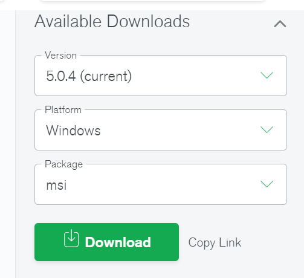

# mongodb 使用

## 1. MongoDB架构介绍

### 1.1 简介

10gen于2007年由DoubleClick的创始人兼CTO Dwight Merriman与工程师Eliot Horowitz联合创办，采用的是一种开源模式，主要通过为客户提供支持、培训以及相关咨询服务获得收益。MongoDB是10gen的主要产品，2007年推出后，作为基于文档的数据库被业界广泛认可，后10gen公司更名为MondoDB公司，主页由10gen.com变为mongodb.com.

MongoDB是一个开源的,基于分布式的,面向文档存储的非关系型数据库,是非关系型数据库当中比较像关系型数据库的.MongoDB由C++编写,起名字来源于”humongous”这个单词,宗旨在于处理大量数据.

在db-engines网站，2021年11月的最新排名中，MongoDB名列第5。


### 1.2 MongoDB特性

MongoDB的特点:

- 面向集合存储，易存储对象类型的数据。

- 模式自由。集合中没有行和列的概念,每个文档可以有不同的key,key的值不要求一致的数据类型.

- 支持动态查询。支持丰富的查询的表达式,查询指令可以使用JSON形式表达式.

- 支持索引。

- 支持复制和故障恢复。

- 使用高效的二进制数据存储，包括大型对象（如视频等）。

- 自动处理碎片，以支持云计算层次的扩展性

- 支持C/C++，PHP,RUBY，PYTHON，JAVA，等多种语言。

- 文件存储格式为BSON（一种JSON的扩展）


## 2. 安装与启动

### 2.1 安装


下载地址：https://www.mongodb.com/try/download/community

可以在这里看到对应的下载信息




### 2.2 启动

```sh
mongod --dbpath=./data
```

也可以配置一个配置文件 mongo.cfg

```sh
#数据库数据存放目录
dbpath=mongodb-home/data/db

#数据库日志存放目录
logpath=mongodb-home/data/logs/mongo.log

#以追加的方式记录日志
logappend = true

#开启用户认证
auth=false

#后台运行
fork=true

#mongodb所绑定的ip地址
bind_ip=0.0.0.0

#端口号 默认为27017
port=27017 

#启用日志文件，默认启用

```

基于配置文件启动mongod

```sh
mongod -f mongo.cfg
```


### mongodb配置验证用户


添加用户


```sh
use admin
db.createUser(
 {
  user: "root",
  pwd: "kong1234",
  roles: [ { role: "root", db: "admin" } ]
 }
)
```

之后可以验证用户是否创建成功

```sh
db.auth("root","密码")
```

客户端登陆

```sh
mongo --port 27017 -u "root" -p "密码" --authenticationDatabase "admin"
```

创建其他用户

```sh
use test
db.createUser(
 {
  user: "tester",
  pwd: "test123",
  roles: [ { role: "readWrite", db: "test" },
       { role: "read", db: "reporting" } ]
 }
)
```


使用其他身份用户登陆

```sh
mongo --port 27017 -u "tester" -p "test123" --authenticationDatabase "test"
```

参考文档：https://www.cnblogs.com/codexueyuan/p/8592319.html


## 3. CURD操作

### 3.1 库的操作

切换或创建库

```sh
use dbname
```

查看库

```sh
show dbs
```

删除库需要2步操作

```sh
use dbname
db.dropDatabase()
```


### 3.2 文档的操作

- 增加文档

```sh
db.COLLECTION_NAME.insert(document)
```
举个例子

```sh
db.test.insert({title: 'mongo test', 
    description: 'MongoDB是Nosql数据库',
    url: 'http://mongodb.com',
    tags: ['mongodb', 'database', 'NoSQL'],
    likes: 200
})
```


- 查看文档

```sh
db.COLLECTION_NAME.find({COND},{FIELDS})

db.test.find().pretty()
{
    "_id" : ObjectId("56ece7acf5fec0105618da63"),
    "title" : "22mongo test",
    "description" : "MongoDB是Nosql数据库",
    "url" : "http://www.baidu.com",
    "tags" : [
        "mongodb",
        "database",
        "NoSQL"
    ],
    "likes" : 200
}

db.test.findone()
```

| ***\*操作\**** | ***\*格式\****         | ***\*范例\****                             | ***\*RDBMS中的类似语句\**** |
| -------------- | ---------------------- | ------------------------------------------ | --------------------------- |
| 等于           | {<key>:<value>}        | db.test.find({"title":"mongo"}).pretty()   | where title = 'mongo'       |
| 小于           | {<key>:{$lt:<value>}}  | db.test.find({"likes":{$lt:50}}).pretty()  | where likes < 50            |
| 小于或等于     | {<key>:{$lte:<value>}} | db.test.find({"likes":{$lte:50}}).pretty() | where likes <= 50           |
| 大于           | {<key>:{$gt:<value>}}  | db.test.find({"likes":{$gt:50}}).pretty()  | where likes > 50            |
| 大于或等于     | {<key>:{$gte:<value>}} | db.test.find({"likes":{$gte:50}}).pretty() | where likes >= 50           |
| 不等于         | {<key>:{$ne:<value>}}  | db.test.find({"likes":{$ne:50}}).pretty()  | where likes != 50           |

- 删除文档

```sh
db.collection.remove(
   <query>,
   {
     justOne: <boolean>,
     writeConcern: <document>
   }
)
```

参数说明：

query :（可选）删除的文档的条件。

justOne : （可选）如果设为 true 或 1，则只删除一个文档。

writeConcern :（可选）抛出异常的级别。

例如：

 db.test.remove({"_id" : ObjectId("56ece690f5fec0105618da62")})

- 修改文档

```sh
db.collection.update(
   <query>,
   <update>,
   {
     upsert: <boolean>,
     multi: <boolean>,
     writeConcern: <document>
   }
)
```

参数说明：

query : update的查询条件，类似sql update查询内where后面的。

update : update的对象和一些更新的操作符（如$,$inc...）等，也可以理解为sql update查询内set后面的

upsert : 可选，这个参数的意思是，如果不存在update的记录，是否插入objNew, true为插入，默认是false，不插入。

multi : 可选，mongodb 默认是false,只更新找到的第一条记录，如果这个参数为true, 就把按条件查出来多条记录全部更新。

*writeConcern :可选，抛出异常的级别。

实例:

我们在集合test中插入如下数据：

\>db.col.insert({

  title: 'MongoDB 教程', 

  description: 'MongoDB 是一个 Nosql 数据库',

  url: 'http://www.baidu.com',

  tags: ['mongodb', 'database', 'NoSQL'],

  likes: 100

})

接着我们通过 update() 方法来更新标题(title):

\>db.col.update({'title':'MongoDB 教程'},{$set:{'title':'MongoDB'}})

WriteResult({ "nMatched" : 1, "nUpserted" : 0, "nModified" : 1 })  # 输出信息

可以看到标题(title)由原来的 "MongoDB 教程" 更新为了 "MongoDB"。以上语句只会修改第一条发现的文档，如果你要修改多条相同的文档，则需要设置 multi 参数为 true。

\>db.col.update({'title':'MongoDB 教程'},{$set:{'title':'MongoDB'}},{multi:true})

***WriteConcern的几种抛出异常的级别参数***：

- WriteConcern.NONE:没有异常抛出

- WriteConcern.NORMAL:仅抛出网络错误异常，没有服务器错误异常(默认)

- WriteConcern.SAFE:抛出网络错误异常、服务器错误异常；并等待服务器完成写操作。(特殊情况可以使用该级别 )

- WriteConcern.MAJORITY: 抛出网络错误异常、服务器错误异常；并等待一个主服务器完成写操作。

- WriteConcern.FSYNC_SAFE: 抛出网络错误异常、服务器错误异常；写操作等待服务器将数据刷新到磁盘。

- WriteConcern.JOURNAL_SAFE:抛出网络错误异常、服务器错误异常；写操作等待服务器提交到磁盘的日志文件。

- WriteConcern.REPLICAS_SAFE:抛出网络错误异常、服务器错误异常；等待至少2台服务器完成写操作。


- 索引操作

```sh
db.COLLECTION_NAME.ensureIndex({KEY:1})
```

语法中 Key 值为你要创建的索引字段，1为指定按升序创建索引，如果你想按降序来创建索引指定为-1即可。


- 聚合函数

MongoDB中聚合(aggregate)主要用于处理数据(诸如统计平均值,求和等) ，并返回计算后的数据结果。有点类似sql语句中的 count(*)。

MongoDB中聚合的方法使用aggregate()。

```sh
db.COLLECTION_NAME.aggregate(AGGREGATE_OPERATION)
```

```js
{
   _id: ObjectId(7df78ad8902c)
   title: 'MongoDB Overview', 
   description: 'MongoDB is no sql database',
   by_user: 'w3cschool.cc',
   url: 'http://www.w3cschool.cc',
   tags: ['mongodb', 'database', 'NoSQL'],
   likes: 100
},
{
   _id: ObjectId(7df78ad8902d)
   title: 'NoSQL Overview', 
   description: 'No sql database is very fast',
   by_user: 'w3cschool.cc',
   url: 'http://www.w3cschool.cc',
   tags: ['mongodb', 'database', 'NoSQL'],
   likes: 10
},
{
   _id: ObjectId(7df78ad8902e)
   title: 'Neo4j Overview', 
   description: 'Neo4j is no sql database',
   by_user: 'Neo4j',
   url: 'http://www.neo4j.com',
   tags: ['neo4j', 'database', 'NoSQL'],
   likes: 750
}
```

现在我们通过以上集合计算每个作者所写的文章数，使用aggregate()计算结果如下：

```js
> db.mycol.aggregate([{$group : {_id : "$by_user", num_tutorial : {$sum : 1}}}])
{
   "result" : [
      {
         "_id" : "w3cschool.cc",
         "num_tutorial" : 2
      },
      {
         "_id" : "Neo4j",
         "num_tutorial" : 1
      }
   ],
   "ok" : 1
```

以上实例类似sql语句： select by_user, count(*) from mycol group by by_user

在上面的例子中，我们通过字段by_user字段对数据进行分组，并计算by_user字段相同值的总和。

### 3.3 高级查询

参考教程：http://cw.hubwiz.com/card/c/543b2f3cf86387171814c026/1/1/11/

参考教程：https://blog.csdn.net/iBenxiaohai123/article/details/85135312

```sh
db.users.find( { age: {$gt:30} } );
db.users.find( { $where: "this.age > 30" } );
```

也可以使用函数

```sh
f = function() { return this.age > 20; }; db.users.find(f);
```

正则表达式使用

```sh
db.users.find({name: {$regex: /^f.*/}});
```


***小任务***


## 4. 副本集实验


### 4.1 初始化副本集

切换至root用户，创建3个目录

```sh
mkdir -p /data/node1
mkdir -p /data/node1
mkdir -p /data/arbiter
```


启动三个节点

```sh
nohup mongod --replSet application --dbpath /data/node1/ --port 9927 --oplogSize 1024 &
nohup mongod --replSet application --dbpath /data/node2/ --port 9928 --oplogSize 1024 &
nohup mongod --replSet application --dbpath /data/arbiter/ --port 9929 --oplogSize 1024 &
```

参数介绍：

- --replSet 用来指定副本集的名称
- --datapath 指定数据目录
- --port 指定数据库侦听端口
- --oplogsize 指定日志大小，单位为M

接下来，登陆9927的mongo

```sh
mongo localhost:9927
```

配置副本集数据

```sh
>config = {_id: "application", members: []}
```

配置3个节点信息

```sh
>config.members.push({_id: 0, host: "localhost:9927"})
>config.members.push({_id: 1, host: "localhost:9928"})
>config.members.push({_id: 2, host: "localhost:9929", arbiterOnly: true})
```

接下来初始化

```sh
>  rs.initiate(config)
{ "ok" : 1 }

```

可以分别登陆第2个节点

```sh
mongo localhost:9928
```

也可以登陆仲裁节点

```sh
mongo localhost:9929
```

可以在3个终端内查看节点变化情况，过一会其中一个变为primary，也就是主节点。

可以使用rs.isMaster()查看情况

```sh
application:PRIMARY> rs.isMaster()
{
	"topologyVersion" : {
		"processId" : ObjectId("619afadd4560ab25189efcf7"),
		"counter" : NumberLong(6)
	},
	"hosts" : [
		"localhost:9927",
		"localhost:9928"
	],
	"arbiters" : [
		"localhost:9929"
	],
	"setName" : "application",
	"setVersion" : 1,
	"ismaster" : true,
	"secondary" : false,
	"primary" : "localhost:9927",
	"me" : "localhost:9927",
	"electionId" : ObjectId("7fffffff0000000000000001"),
	"lastWrite" : {
		"opTime" : {
			"ts" : Timestamp(1637547519, 1),
			"t" : NumberLong(1)
		},
		"lastWriteDate" : ISODate("2021-11-22T02:18:39Z"),
		"majorityOpTime" : {
			"ts" : Timestamp(1637547519, 1),
			"t" : NumberLong(1)
		},
		"majorityWriteDate" : ISODate("2021-11-22T02:18:39Z")
	},
	"maxBsonObjectSize" : 16777216,
	"maxMessageSizeBytes" : 48000000,
	"maxWriteBatchSize" : 100000,
	"localTime" : ISODate("2021-11-22T02:18:45.333Z"),
	"logicalSessionTimeoutMinutes" : 30,
	"connectionId" : 1,
	"minWireVersion" : 0,
	"maxWireVersion" : 13,
	"readOnly" : false,
	"ok" : 1,
	"$clusterTime" : {
		"clusterTime" : Timestamp(1637547519, 1),
		"signature" : {
			"hash" : BinData(0,"AAAAAAAAAAAAAAAAAAAAAAAAAAA="),
			"keyId" : NumberLong(0)
		}
	},
	"operationTime" : Timestamp(1637547519, 1)
}

```

也可以使用rs.status()和rs.conf()查看信息


### 4.2 测试数据同步


在主节点操作

```sh
application:PRIMARY> db.users.insert({name:"yekai",age:40})
WriteResult({ "nInserted" : 1 })
application:PRIMARY> db.users.find()
{ "_id" : ObjectId("619b001b18f4a0cf160edc1f"), "name" : "yekai", "age" : 40 }

```

在从节点查看数据

```sh
application:SECONDARY> db.users.find()
Error: error: {
	"topologyVersion" : {
		"processId" : ObjectId("619afb1f931f799e7b7398d7"),
		"counter" : NumberLong(4)
	},
	"ok" : 0,
	"errmsg" : "not master and slaveOk=false",
	"code" : 13435,
	"codeName" : "NotPrimaryNoSecondaryOk",
	"$clusterTime" : {
		"clusterTime" : Timestamp(1637548100, 1),
		"signature" : {
			"hash" : BinData(0,"AAAAAAAAAAAAAAAAAAAAAAAAAAA="),
			"keyId" : NumberLong(0)
		}
	},
	"operationTime" : Timestamp(1637548100, 1)
}

```

从节点需要意识到自己的从属地位之后才能查看数据。

```sh
application:SECONDARY> rs.secondaryOk()

```

从节点查看数据

```sh
application:SECONDARY> show tables
users
application:SECONDARY> show collections
users
application:SECONDARY> db.users.find()
{ "_id" : ObjectId("619b001b18f4a0cf160edc1f"), "name" : "yekai", "age" : 40 }

```

可以再次从主节点插入数据

```sh
application:PRIMARY> db.users.insert({name:"fuhongxue",age:41})
WriteResult({ "nInserted" : 1 })
```

之后再在从节点查看

```sh
application:SECONDARY> db.users.find()
{ "_id" : ObjectId("619b001b18f4a0cf160edc1f"), "name" : "yekai", "age" : 40 }
{ "_id" : ObjectId("619b017818f4a0cf160edc20"), "name" : "fuhongxue", "age" : 41 }
```

尝试在从节点插入数据，提示报错，从节点无权限写数据

```sh
application:SECONDARY> db.users.insert({name:"luxiaojia",age:33})
WriteCommandError({
	"topologyVersion" : {
		"processId" : ObjectId("619afb1f931f799e7b7398d7"),
		"counter" : NumberLong(4)
	},
	"ok" : 0,
	"errmsg" : "not master",
	"code" : 10107,
	"codeName" : "NotWritablePrimary",
	"$clusterTime" : {
		"clusterTime" : Timestamp(1637548500, 1),
		"signature" : {
			"hash" : BinData(0,"AAAAAAAAAAAAAAAAAAAAAAAAAAA="),
			"keyId" : NumberLong(0)
		}
	},
	"operationTime" : Timestamp(1637548500, 1)
})

```

杀掉主节点，之后检测节点的关系变化

```sh
[root@jbf138 fabric]# ps aux |grep mongod
root       2662  1.5  3.7 1908576 144884 pts/1  Sl   18:05   0:28 mongod --replSet application --dbpath /data/node1/ --port 9927 --oplogSize 1024
root       2722  1.5  3.7 1910548 143080 pts/1  Sl   18:06   0:28 mongod --replSet application --dbpath /data/node2/ --port 9928 --oplogSize 1024
root       2780  1.2  2.9 1765260 114608 pts/1  Sl   18:06   0:23 mongod --replSet application --dbpath /data/arbiter/ --port 9929 --oplogSize 1024
#杀掉主节点pid
kill -9 2662
```

此时，会发现原来的从节点主动变为主节点，再次提交数据，可以成功

```sh
application:SECONDARY> 
application:PRIMARY> db.users.insert({name:"luxiaojia",age:33})
WriteResult({ "nInserted" : 1 })
```

再次启动原9927端口的mongod

```sh
nohup mongod --replSet application --dbpath /data/node1/ --port 9927 --oplogSize 1024 &
```

再次登陆后，该节点已经成为了从节点。

