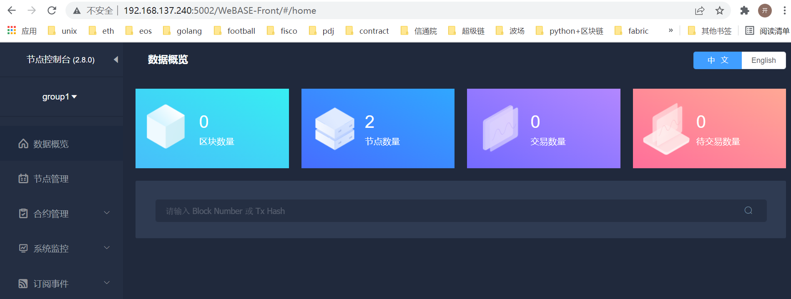

# fisco-bcos安装


## 1. 安装fisco-bcos

下载

```sh
git clone https://gitee.com/FISCO-BCOS/generator.git
```

安装(需要sudo权限)

```sh
cd ~/generator && bash ./scripts/install.sh
```

检查genrator是否安装成功

```sh
./generator -h
```


下载二进制节点程序

```sh
./generator --download_fisco ./meta --cdn
```

检查二进制版本

```sh
./meta/fisco-bcos -v
```


## 2. 节点配置与启动


以单机构单主机双节点为例，配置文件如下

```sh
[fabric@teacher233 tmp_one_click]$ cat tmp_one_click/agencyA/node_deployment.ini 
[group]
group_id=1

; Owned nodes
[node0]
; host ip for the communication among peers.
; Please use your ssh login ip.
p2p_ip=127.0.0.1
; listen ip for the communication between sdk clients.
; This ip is the same as p2p_ip for physical host.
; But for virtual host e.g. vps servers, it is usually different from p2p_ip.
; You can check accessible addresses of your network card.
; Please see https://tecadmin.net/check-ip-address-ubuntu-18-04-desktop/
; for more instructions.
rpc_ip=127.0.0.1
channel_ip=0.0.0.0
p2p_listen_port=30300
channel_listen_port=20200
jsonrpc_listen_port=8545

[node1]
p2p_ip=127.0.0.1
rpc_ip=127.0.0.1
channel_ip=0.0.0.0
p2p_listen_port=30301
channel_listen_port=20201
jsonrpc_listen_port=8546

```

删除agencyB目录

```sh
rm -rf tmp_one_click/agencyB
```

生成节点

```sh
bash ./one_click_generator.sh -b ./tmp_one_click
```

将节点配置相关挪到方便使用目录

```sh
mv tmp_one_click/agencyA/ ~/fisco/
cd ~/fisco/
```

启动节点

```sh
bash agencyA/node/start_all.sh
```

检查节点是否运行

```sh
ps -ef|grep fisco-bcos
```


## 3. WeBASE-Front安装

参考教程：

https://webasedoc.readthedocs.io/zh_CN/latest/docs/WeBASE-Install/developer.html

前置条件：

| 环境    | 版本                |
| ------- | ------------------- |
| Java    | JDK8或以上版本      |
| MySQL   | MySQL-5.6或以上版本 |
| Python  | Python3.5+          |
| PyMySQL | 使用python3时需安装 |

安装mysql包

```sh
sudo pip3 install PyMySQL
```

下载安装包

```sh
wget https://osp-1257653870.cos.ap-guangzhou.myqcloud.com/WeBASE/releases/download/v1.5.4/webase-front.zip
```

解压缩

```sh
unzip webase-front.zip
cd webase-front
```

拷贝证书文件

```sh
[fabric@teacher233 conf]$ cp ~/fisco/agencyA/sdk/sdk.* conf/
[fabric@teacher233 conf]$ cp ~/fisco/agencyA/sdk/ca.crt conf/

```

修改配置文件

```s
conf/application.yml 
```

配置文件主要修改nodePath，将其路径指向到之前启动的节点路径下，示例如下

```sh
nodePath: fisco/agencyA/node/node_127.0.0.1_30300
```

启动
```sh
bash start.sh
```

检查5002端口是否启动

```sh
$ netstat -anp|grep 5002
(Not all processes could be identified, non-owned process info
 will not be shown, you would have to be root to see it all.)
tcp6       0      0 :::5002                 :::*                    LISTEN      5452/java  
```

此时，可以通过地址：
http://192.168.137.240:5002/WeBASE-Front/#/home

访问区块链浏览器情况。

看到如下效果，就代表WeBASE-Front安装成功了。

