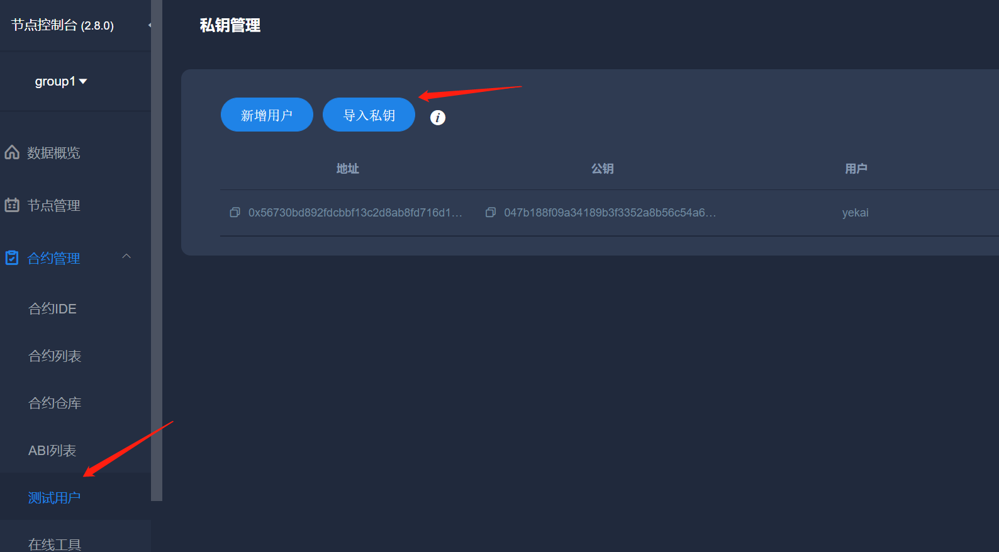

# python-sdk使用


## 1. 控制台使用

下载python-sdk工程

```sh
git clone https://github.com/FISCO-BCOS/python-sdk
```

安装依赖

```sh
cd python-sdk 
pip install -r requirements.txt
```


创建账户

```sh
python-sdk$ python3 console.py newaccount yekai yekai123

INFO >> user input : ['newaccount', 'yekai', 'yekai123']

starting : yekai yekai123  , if save:False
new address :    0x56730bD892FDcBbf13c2d8AB8Fd716D1D9231923
new privkey :    0xe2c36a79077866ac8b514d313baf4e84668775fbc340a914ce0ddf702e6ff35a
new pubkey :     0x7b188f09a34189b3f3352a8b56c54a6c91577d9967c8cedb6bd47936e4adaa4f3e829b9fa5dc275f5773bff0905fc08b75a3f7a1bc5eee39d2fba1cf8e4f9baa
encrypt use time : 0.825 s
save to file : [bin/accounts/yekai.keystore]
>>-------------------------------------------------------
INFO >> read [bin/accounts/yekai.keystore] again after new account,address & keys in file:
decrypt use time : 0.809 s
address:         0x56730bD892FDcBbf13c2d8AB8Fd716D1D9231923
privkey:         0xe2c36a79077866ac8b514d313baf4e84668775fbc340a914ce0ddf702e6ff35a
pubkey :         0x7b188f09a34189b3f3352a8b56c54a6c91577d9967c8cedb6bd47936e4adaa4f3e829b9fa5dc275f5773bff0905fc08b75a3f7a1bc5eee39d2fba1cf8e4f9baa

account store in file: [bin/accounts/yekai.keystore]

**** please remember your password !!! *****
```


## 2. 导入私钥到webase-front

可以将此私钥导入到webase-front环境



点击【导入私钥】按钮，输入用户名和私钥，点击【确定】


这样就可以导入私钥了。


## 3. 配置python-sdk的运行环境

修改client_config.py文件。

```python
 # ---------client communication config--------------
    client_protocol = PROTOCOL_RPC  # or PROTOCOL_CHANNEL to use channel prototol
    # client_protocol = PROTOCOL_CHANNEL
    remote_rpcurl = "http://192.168.137.181:8545"  # 采用rpc通信时，节点的rpc端口,和要通信的节点*必须*一致,如采用channel协议通信，这里可以留空
    channel_host = "192.168.137.181"  # 采用channel通信时，节点的channel ip地址,如采用rpc协议通信，这里可以留空
    channel_port = 20200  # 节点的channel 端口,如采用rpc协议通信，这里可以留空
    channel_ca = "bin/ca.crt"  # 采用channel协议时，需要设置链证书,如采用rpc协议通信，这里可以留空
    channel_node_cert = "bin/sdk.crt"  # 采用channel协议时，需要设置sdk证书,如采用rpc协议通信，这里可以留空
    channel_node_key = "bin/sdk.key"   # 采用channel协议时，需要设置sdk私钥,如采用rpc协议通信，这里可以留空
    contract_info_file = "bin/contract.ini"  # 保存已部署合约信息的文件
    account_keyfile_path = "bin/accounts"  # 保存keystore文件的路径，在此路径下,keystore文件以 [name].keystore命名
    account_keyfile = "yekai.keystore"
    account_password = "yekai123"  # 实际使用时建议改为复杂密码
```

- 填写remote_rpcurl和channel_host，注意需要将fisco-bcos节点的8545设置为非本机模式
- 修改私钥文件相关信息，包含account_keyfile_path、account_keyfile、account_password

其中account_keyfile为之前控制台创建的私钥文件，account_password为对应的密码。


## 4. 调用智能合约

可以在webase-front环境部署helloworld合约

```js
pragma solidity ^0.6.10;

contract HelloWorld{
    string name;
    event onset(string newname);
    constructor() public{
       name = "Hello, World!";
    }

    function get() view public returns(string memory){
        return name;
    }

    function set(string memory n) public{
	emit onset(n);
    	name = n;
    }
}
```

部署后可以得到地址于ABI信息，合约地址为：0x792a54133323321bd7ef73374e48b18529e264e3


合约调用前，需要先将fisco-bcos节点的证书文件拷贝至本工程的bin目录下，下面代码使用的abi和合约地址（0x792a54133323321bd7ef73374e48b18529e264e3）为之前部署的信息。

```python
import sys
sys.path.append("../../python-sdk")
from client.bcosclient import BcosClient


client = BcosClient()
abi = [{"inputs":[],"stateMutability":"nonpayable","type":"constructor"},{"anonymous":False,"inputs":[{"indexed":False,"internalType":"string","name":"newname","type":"string"}],"name":"onset","type":"event"},{"inputs":[],"name":"get","outputs":[{"internalType":"string","name":"","type":"string"}],"stateMutability":"view","type":"function"},{"inputs":[{"internalType":"string","name":"n","type":"string"}],"name":"set","outputs":[],"stateMutability":"nonpayable","type":"function"}]

data = client.call("0x792a54133323321bd7ef73374e48b18529e264e3",abi,"get")
print(data)
data = client.sendRawTransactionGetReceipt("0x792a54133323321bd7ef73374e48b18529e264e3",abi,"set",["aa"])
print(data)
data = client.call("0x792a54133323321bd7ef73374e48b18529e264e3",abi,"get")
print(data)

client.finish()
```

