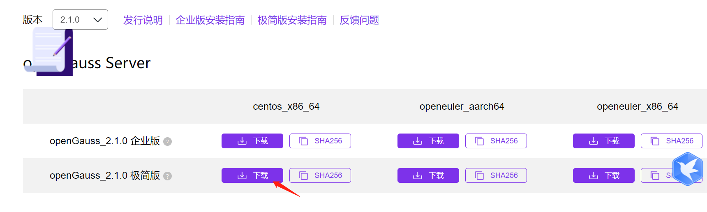

# opengauss 教程


## 1. 安装单节点

CSDN上找到一个参考教程：

https://blog.csdn.net/RANGO_CSDN/article/details/118761322

本文介绍如何在centOS系统上安装opengauss，操作系统版本为7.2

创建dbgrp组、omm用户，omm用户是未来操作数据库的主要用户

```sh
groupadd dbgrp
useradd -g dbgrp -G root -d /home/omm -m -s /bin/bash omm
passwd omm

```

创建opengauss目录

```sh
mkdir -p /opt/software/openGauss
chmod 777 -R /opt
```

下载软件包地址：https://opengauss.org/zh/download.html

下载安装包，选择centOS对应的文件版本



```sh
wget https://opengauss.obs.cn-south-1.myhuaweicloud.com/2.1.0/x86/openGauss-2.1.0-CentOS-64bit.tar.bz2
```


安装依赖文件

```sh
yum install acpid.x86_64 at.x86_64 attr.x86_64 autogen-libopts.x86_64 bc.x86_64 bind-libs.x86_64 bind-utils.x86_64 bridge-utils.x86_64 bzip2.x86_64 c-ares.x86_64 checkpolicy.x86_64 cifs-utils.x86_64 crash.x86_64 cryptsetup.x86_64 cups-client.x86_64 cvs.x86_64 cyrus-sasl.x86_64 cyrus-sasl-gssapi.x86_64 cyrus-sasl-plain.x86_64 ed.x86_64 gamin.x86_64 gdbm-devel.x86_64 glibc-devel.x86_64 glibc-headers.x86_64 gnutls.x86_64 hdparm.x86_64 hesiod.x86_64 http-parser.x86_64 iotop.noarch ipmitool.x86_64 iptables-services.x86_64 ipvsadm.x86_64 kernel-headers.x86_64 keyutils.x86_64 libasyncns.x86_64 libbasicobjects.x86_64 libcgroup.x86_64 libcollection.x86_64 libdb-devel.x86_64 libdhash.x86_64 libevent.x86_64 libgudev1.x86_64 libini_config.x86_64 libipa_hbac.x86_64 libitm.x86_64 libldb.x86_64 libmodman.x86_64 libnfsidmap.x86_64 libnl.x86_64 libpath_utils.x86_64 libpcap.x86_64 libproxy.x86_64 libref_array.x86_64 libreport-filesystem.x86_64 libsmbclient.x86_64 libsss_autofs.x86_64 libsss_certmap.x86_64 libsss_idmap.x86_64 libsss_nss_idmap.x86_64 libsss_sudo.x86_64 libtalloc.x86_64 libtar.x86_64 libtdb.x86_64 libtevent.x86_64 libtirpc.x86_64 libtool-ltdl.x86_64 libusb.x86_64 libusbx.x86_64 libwbclient.x86_64 libxml2-python.x86_64 lm_sensors-libs.x86_64 lsof.x86_64 m2crypto.x86_64 m4.x86_64 mailx.x86_64 mdadm.x86_64 mlocate.x86_64 net-snmp.x86_64 net-snmp-agent-libs.x86_64 net-snmp-libs.x86_64 net-snmp-utils.x86_64 nettle.x86_64 nscd.x86_64 nss_compat_ossl.x86_64 ntp.x86_64 ntpdate.x86_64 numactl.x86_64 numad.x86_64 oddjob.x86_64 oddjob-mkhomedir.x86_64 OpenIPMI.x86_64 OpenIPMI-libs.x86_64 OpenIPMI-modalias.x86_64 openldap-clients.x86_64 openldap-servers.x86_64 pam_krb5.x86_64 patch.x86_64 pax.x86_64 pciutils.x86_64 perl-Compress-Raw-Bzip2.x86_64 perl-Compress-Raw-Zlib.x86_64 perl-Data-Dumper.x86_64 perl-DBI.x86_64 perl-devel.x86_64 perl-ExtUtils-Install.noarch perl-ExtUtils-MakeMaker.noarch perl-ExtUtils-Manifest.noarch perl-ExtUtils-ParseXS.noarch perl-IO-Compress.noarch perl-Net-Daemon.noarch perl-PlRPC.noarch perl-Test-Harness.noarch perl-version.x86_64 pm-utils.x86_64 portreserve.x86_64 procmail.x86_64 psmisc.x86_64 pygobject2.x86_64 pyOpenSSL.x86_64 pyparsing.noarch pytalloc.x86_64 python-chardet.noarch python-dateutil.noarch python-dmidecode.x86_64 python-ethtool.x86_64 python-kitchen.noarch python-sssdconfig.noarch pytz.noarch quota.x86_64 quota-nls.noarch redhat-lsb-core.x86_64 redhat-lsb-submod-security.x86_64 rng-tools.x86_64 rpcbind.x86_64 rsync.x86_64 samba-client-libs.x86_64 samba-common.noarch samba-common-libs.x86_64 sdparm.x86_64 sendmail.x86_64 sg3_utils-libs.x86_64 smartmontools.x86_64 spax.x86_64 sssd.x86_64 sssd-ad.x86_64 sssd-client.x86_64 sssd-common.x86_64 sssd-common-pac.x86_64 sssd-ipa.x86_64 sssd-krb5.x86_64 sssd-krb5-common.x86_64 sssd-ldap.x86_64 sssd-proxy.x86_64 stix-fonts.noarch sysstat.x86_64 system-config-firewall-base.noarch systemtap-sdt-devel.x86_64 tcp_wrappers.x86_64 time.x86_64 traceroute.x86_64 trousers.x86_64 unixODBC.x86_64 unzip.x86_64 usermode.x86_64 yum-utils.noarch zip.x86_64 expect -y

```

环境检查:

- 默认占用5432端口，如果之前安装postgres，可能会有冲突
- SEMMNI 数值默认可能不够大，需要修改：在/etc/sysctl.conf中加入语句`kernel.sem = 250 32000 100 999`，然后执行`sysctl -p`


解压缩文件

```sh
tar -xvf openGauss-2.1.0-CentOS-64bit.tar.bz2
```

安装简单版

```sh
cd simpleInstall
```

执行安装

```sh
sh install.sh -w Abcd@123
```

如果安装顺序，会提示是否导入初始的sql文件，输入yes即可。

可以检查gaussdb是否运行

```sh
ps aux|grep gaussdb
```

使用gs_ctl检查运行情况

```sh
gs_ctl query -D /opt/software/openGauss/data/single_node
```


可以使用gsql登录

```sh
$ gsql -d postgres -p 5432 -r
gsql ((openGauss 2.1.0 build 590b0f8e) compiled at 2021-09-30 14:29:04 commit 0 last mr  )
Non-SSL connection (SSL connection is recommended when requiring high-security)
Type "help" for help.

openGauss=# \l
                              List of databases
   Name    | Owner | Encoding |   Collate   |    Ctype    | Access privileges
-----------+-------+----------+-------------+-------------+-------------------
 finance   | omm   | UTF8     | en_US.UTF-8 | en_US.UTF-8 |
 postgres  | omm   | UTF8     | en_US.UTF-8 | en_US.UTF-8 |
 school    | omm   | UTF8     | en_US.UTF-8 | en_US.UTF-8 |
 template0 | omm   | UTF8     | en_US.UTF-8 | en_US.UTF-8 | =c/omm           +
           |       |          |             |             | omm=CTc/omm
 template1 | omm   | UTF8     | en_US.UTF-8 | en_US.UTF-8 | =c/omm           +
           |       |          |             |             | omm=CTc/omm
(5 rows)

```

